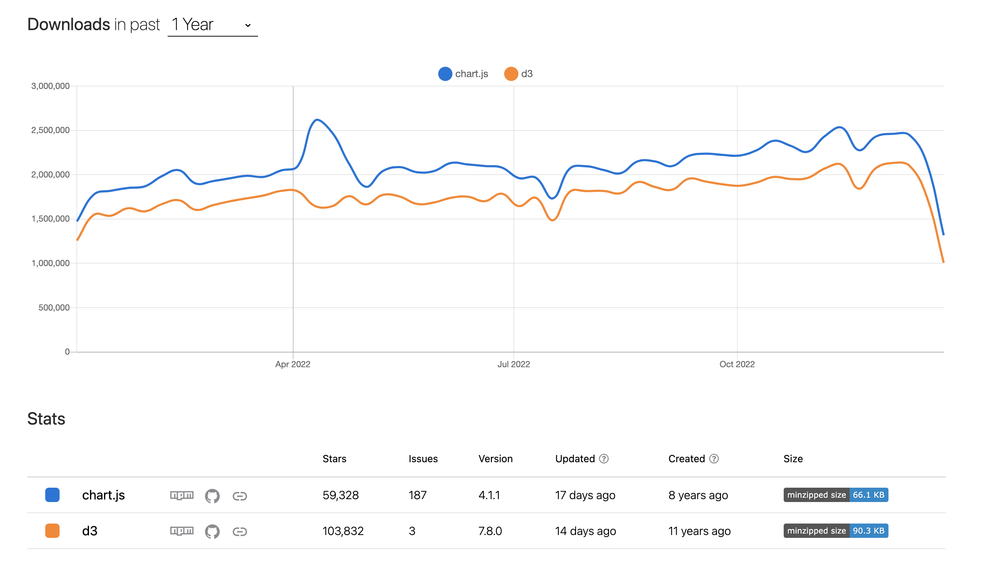

# 👉 JavaScript

> 1. [모던 자바스크립트 튜토리얼](https://ko.javascript.info/)
> 2. [코어 자바스크립트](https://saseungmin.github.io/reading_books_record_repository/docs/javascript/core-javascript/table-of-contents)

### 🎈 const와 var의 차이점은?
var은 블록 레벨 스코프가 아닌 함수 레벨 스코프를 따르기 때문에 전역에서 참조할 수 있고, let이나 const는 블록 레벨 스코프를 따르기 때문에 지역 변수로 코드 블록내애서만 접근이 가능합니다.   
var은 변수 선언 전에 참조해도 에러가 나지 않고 undefined를 반환하지만, let은 변수 선언문전에 해당 변수를 참조하면 Reference Error를 반환합니다.   
이러한 이유를 실행 컨텍스트 관점에서 보자면 var은 **변수 선언과 초기화과정이 동시에** 일어나게 되는데, 스코프에 변수를 등록하고 변수를 메모리에 등록할 공간을 확보한 후 undefined 초기화 과정을 거쳤기 때문에 선언 이전에 참조해도 undefined를 반환할 수 있는 것입니다. let은 **변수 선언과 초기화 과정이 따로** 이루어지는데, 이전에 변수를 참조하게 되면 스코프에 변수를 등록하지만 변수를 메모리에 할당할 공간을 확보하지 못하고 변수 선언문을 만난 그 시점에 초기화 과정이 이루어지기 때문에 이전에 참조하면 참조에러가 발생하게 됩니다. 그래서 이것을 스코프의 시작부터 변수 선언문전까지의 공간을 **TDZ**(**일시적 사각지대**)라고 합니다.   
let과 var은 재할당이 가능하지만 const는 재할당이 불가능합니다. 그렇기 때문에 const는 변수를 선언과 동시에 할당을 해야 합니다.   

> 참고: https://poiemaweb.com/es6-block-scope

### 🎈 호이스팅이란
호이스팅이란 개념자체는 코드 해석을 좀 더 수월하게 하기 위해 끌어올린다라고 해석하고 있습니다.   
변수가 선언과 값 할당이 같이 이루어진 문장은 선언부만 호이스팅 되고, 할당문은 그자리에 그대로 유지하고 있게됩니다. 이때 함수의 선언문과 함수 표현식의 차이점이 있는데 함수 선언문은 함수자체 통체로 끌어올리게되고, 함수 표현식은 식이기 때문에 선언부만 호이스팅 됩니다.   

자바스크립트에서 ES6에 도입된 let, const를 포함하여 모든 선언을 호이스팅한다.
### 🎈 실행 컨텍스트
실행 컨텍스트란 실행할 코드에 대한 환경 정보를 담고 있는 객체로 전역 공간에서 자동으로 생성되는 전역 컨텍스트와 함수 실행에 의한 컨텍스트등이 있습니다.   
실행 컨텍스트 객체는 활성화 될 시점에 VariableEnvironment, LexicalEnvironment, thisBinding 세가지 정보를 수집합니다. 실행 컨텍스트가 생성될 때 VariableEnvironment, LexicalEnvironment는 동일한 냉용으로 구성되지만, VariableEnvironment는 초기상태를 유지합니다.   
VariableEnvironment와 LexicalEnvironment는 매개변수명, 변수의 식별자, 함수의 함수명 등의 정보를 수집하는 environmentRecord와 바로 직전 컨텍스트의 LexicalEnvironment 정보를 참조하는 outerEnvironmentReference로 구성되어 있습니다.    
outerEnvironmentReference는 해당 함수가 선언된 위치의 LexicalEnvironment를 참조합니다. 만약 코드의 변수에 대해 접근하기 위해서 LexicalEnvironment를 참조하는데 만약 LexicalEnvironment에 해당 변수에 대한 정보가 존재할 경우는 LexicalEnvironment의 정보를 사용하고, 만약 없을 경우에는 outerEnvironmentReference에 담긴 바로 직전 컨텍스트의 LexicalEnvironment를 참조하게 됩니다. 이때 전역 컨텍스트의 LexicalEnvironment까지도 변수에 대한 정보를 발견하지 못하면 undefined를 반환하게 됩니다. 이러한 과정을 스코프체인이라고 하며, 이러한 구조적인 특성 덕분에 여러 스코프에서 동일한 식별자가 존재하는 경우에도 가장 먼저 발견된 식별자에게만 접근할 수 있게 되는 것 입니다.   
thisBinding은 this로 지정된 객체가 저장되는데, 만약 this가 지정되지 않았을 때는 this는 전역 객체가 저장되고, 그 외에는 함수의 호출방법에 따라 this에 저장되는 대상이 달라집니다.


> 참고: https://saseungmin.github.io/reading_books_record_repository/docs/javascript/core-javascript/chapter-2

### 🎈 this
this는 실행 컨텍스트가 생성될 때 함께 결정됩니다. 실행 컨텍스트는 함수가 호출될때 결정되기 때문에 this의 생성도 함수를 호출할 때 결정된다고 볼 수 있습니다. 그렇기 때문에 this는 상황에 따라서 달라집니다.
일단, 전역 공간에서의 this는 브라우저에서는 window, node.js에서는 global을 참조합니다.   
함수가 메소드로써 호출되는 경우 메소드를 호출시킨 객체를 참조하는데, 메서드 명의 바로 앞의 객체를 참조합니다.   
어떤 함수가 함수로써 호출되는 경우는 this는 전역 객체를 참조합니다. 이때 메서드 내부함수에서도 this는 전역객체를 참조합니다. 이 메서드 내부에서 함수를 w전역 객체를 보지 않게 하는 방법으로는 메서드 내부에서 self와 같은 변수를 사용해 함수 상위 스코프에 this를 self로 할당 한 뒤 활용할 수도 있고, this를 바인딩하지 않는 화살표함수를 사용하면 이 문제를 해결 할 수 있고, 명시적으로 this를 바인딩시켜주는 call apply bind를 사용하여 문제를 해결 할 수 있습니다.   
콜백 함수 내부에서의 this는 콜백 함수의 제어권을 넘겨받은 함수가 정의한바에 따르며, 만약 정의되지 않을 경우에는 this는 전역 객체를 참조하게 됩니다.   
생성자에서의 this는 생성할 인스턴스를 참조하게 됩니다.   
또한, 명시적으로 this를 바인딩하는 방법도 있는데 apply와 call은 둘의 기능적으로는 차이는 없지만, apply는 인자를 배열로 받는 반면, call은 인자 목록을 순서대로 받습니다.   
ES5에 나온 bind는 call과 유사하지만, 차이점은 call은 함수를 호출하지만, bind는 호출을 하지 않고 함수를 반환합니다. 이러한 bind의 기능 덕분에 this를 미리 적용하는 것과 부분함수적용하는 두가지 목적을 지닙니다. 그리고 bind를 사용해 새로 만든 함수는 name 프로퍼티에 bound라는 bind의 수동태 접두어가 붙기 때문에, call이나 apply보다 코드를 추적하는데 더 수월합니다.

> 참고: https://saseungmin.github.io/reading_books_record_repository/docs/javascript/core-javascript/chapter-3

### 🎈 클로저
```js
function outer() {
  var k = 1;

  function inner() {
    console.log(k);
  }

  return inner;
}

var func = outer();
func(); // 1;
```

inner 함수에서 outer의 변수 k에 접근할 수 있는 방법을 실행 컨텍스트 관점에서 설명하면 inner 함수내에서 참조하고 있는 k 식별자를 inner의 LexicalEnvironment를 참조해서 k의 정보가 존재하는지 확인합니다. 그렇지만, 존재하지 않기 때문에 바로 직전 컨텍스트의 LexicalEnvironment 정보를 참고하고 있는 inner의 outerEnvironmentReference에서 변수 k의 정보를 찾을 수 있기 때문에 상위 스코프의 k의 정보를 찾을 수 있는 것입니다.   
outer가 호출되고 outer 함수의 실행컨텍스트가 종료되면 LexicalEnvironment에 있는 k를 가비지 컬렉터가 지우게 됩니다. 하지만, 가비지 컬렉터는 어떤 값을 참조하는 변수가 하나라도 존재한다면 그 값은 가비지컬렉터의 수집대상에서 제외되게 됩니다. 그렇기 때문에 outer가 호출된 후 inner를 반환하고 내부함수인 inner를 언제든지 호출할 가능성이 열려있기 때문에 즉, 변수 k에 언제든지 접근할 수 있기 때문에 가비지 컬렉터의 수집대상에서 제외되게 됩니다.   
이처럼 클로저란 어떤 함수 A의 변수 k가 존재할때 k를 참조하는 내부 함수 B가 외부로 전달된 경우 A의 실행 컨텍스트가 종료된 이후에도 외부 함수 A의 변수 k가 사라지지 않는 현상이라고 합니다.   

그래서 보통 클로저를 활용하여 커링이라는 기법을 사용하였는데 커링은 둘 이상의 매개 변수가 있는 함수가 여러 함수로 분리된 패턴으로, 필요한 모든 매개 변수가 한 번에 하나씩 누적됩니다. 이 기법은 함수형 스타일로 작성된 코드를 읽고, 합성하기 더 쉬워진 경우 유용할 수 있습니다.
제가 보통 사용하는 방법은

```js
const curry = (message) => (name) => `hi! ${name} ${message}`;

const greeting  = curry('안녕하세요!');

greeting('harang'); // hi! harang 안녕하세요!
greeting('승민'); // hi! 승민 안녕하세요!
```

> 참고: https://saseungmin.github.io/reading_books_record_repository/docs/javascript/core-javascript/chapter-5

### 🎈 스코프
스코프란 어떤 대상을 다른 대상과 구분하여 식별할 수 있는 유일한 이름을 찾아내기 위한 규칙입니다. 이 식별자는 자신이 어디에 선언되어있는지에 의해 자신의 유효한 범위를 찾습니다.

```js
var x = 'global';

function foo () {
  var x = 'function scope';
  console.log(x);
}

foo(); // function scope
console.log(x); // global
```

위 예처럼 전역에 선언된 변수 x는 어디에서든 참조가 가능하지만, foo함수 내부에 있는 변수 x는 foo내부에서만 참고가 가능합니다. 이러한 규칙을 스코프라고 합니다. 이처럼 전역 스코프와 지역 스코프로 구분짓습니다.   
자바스크립트의 스코프는 함수 레벨 스코프를 따릅니다. 즉, 함수 코드 블록 내부에서 선언된 변수는 함수 내부에서만 참조가능하고, 함수외부에서는 참조가 불가능한 것을 말합니다. 하지만, let 키워드를 사용하면 블록 레벨 스코프를 사용할 수 있습니다.   
자바스크립트는 렉시컬 스코프를 따르는데 렉시컬 스코프란 함수가 실행될 당시에 스코프가 결정되는 것이 아닌, 함수가 선언된 위치에 따라 스코프가 결정되는 것을 말합니다.

### 🎈 IIFE (Immediately-Invoked Function Expression, 즉시 실행 함수)
즉시 실행 함수는 말 그대로 함수를 정의하자마자 실행하는 것을 즉시 실행 함수라고 합니다.   
즉시 실행 함수를 사용하는 이유는 보통 전역 스코프를 오염시키지 않기 위해 사용합니다. 그래서 즉시 실행 함수를 사용하여 안에 클로저를 만들고 그 안에 지역 변수를 사용하여 private 데이터를 만들 수 있습니다. 그렇기 때문에 변수 사용 충돌을 막을 수도 있습니다.

### 🎈 이벤트 버블링, 캡처링, 위임
이벤트 버블링이란 하위 엘리먼트에 이벤트가 발생할 때 그 엘리먼트로부터 시작해서 상위 요소까지 이벤트가 전달되는 방식입니다. 기본적인 동작방식은 이벤트 버블링입니다.   
이벤트 캡처링으로 변경하려면 addEventListener의 마지막 인자로 capture true를 주면됩니다. 이때 이렇게 설정한 뒤 해당 엘리먼트를 클릭하면 적용된 엘리먼트부터 이벤트가 발생하고 다시 이벤트 버블링 방식으로 동작합니다.   

이벤트 위임은 동일한 또는 비슷한 방식으로 여러 요소를 다뤄야할 때 사용되는데, 이벤트 위임을 사용하면 각자마다 이벤트를 등록하지 않아도되고, 상위 엘리먼트에 단 하나의 이벤트를 등록하면 여러 엘리먼트를 다룰 수 있게 됩니다. 이렇듯 이벤트 위임의 장점은 작성해야할 코드의 수가 줄어들고 그만큼 메모리도 절약할 수 있습니다. 단점으로는 이벤트 위임을 사용하기 위해서는 이벤트가 반드시 버블링 되야합니다.   

### 🎈 콜 스택과 힙
자바스크립트 엔진이 자바스크립트를 실행할 때 원시 타입이나 참조 타입을 저장할 메모리 구조로 콜 스택과 힙을 사용합니다.   
콜 스택은 원시 타입 값과 함수가 실행될 때의 실행 컨텍스트를 저장합니다. 힙은 객체, 배열, 함수등 동적으로 변화하는 참조 타입을 저장합니다.

### 🎈 프로토타입
어떤 생성자 함수를 new 연산자와 함께 호출하면 Constructor에 정의된 정보를 바탕으로 인스턴스를 생성하게 되고, 이 인스턴스에는 `__proto__` 라는 constructor의 prototype 프로퍼티를 참조하는 프로퍼티가 자동으로 부여가 됩니다.
`__proto__`은 생략이 가능하기 때문에 인스턴스는 constructor의 prototype을 자신의 메서드인것처럼 호출할 수 있습니다.
`__proto__` 방향으로 계속 나아가다보면 최종적으로 Object.prototype에 도달하게되는데, 이러한 `__proto__`안에 다시 `__proto__`를 찾아가는 방식을 프로토타입 체인닝이라고 합니다. 이러한 구조적인 원리 때문에 저희는 각자의 프로토타입 메서드를 자신의 메서드인냥 호출이 가능합니다. 이때의 접근 방식은 자신으로부터 가장 가까운 대상에서부터 먼 대상으로 나아가며, 원하는 값을 찾으면 중단하게 됩니다.
Object.prototype에는 모든 데이터 타입이 사용할 수 있는 hasOwnProperty 범용적인 메서드들이 존재하며, 객체만을 위한 메서드는 Object 생성자 안에 스택틱하게 담겨있습니다.

### 🎈 자바스크립트의 비동기 작업 처리방식
자바스크립트는 내부적으로 stack, webapis, task queue, event loop가 존재합니다. stack은 스코프 단위로 수행되며, webapis는 비동기적 처리할 작업을 스택으로 넘겨받은 후 해당 코드를 실행합니다. task queue는 webapis에서 비동기적 처리가 끝난 작업이 task queue에 쌓이게 됩니다. event loop는 stack에 남은 할일이 존재하지 않으면 대기중인 task queue를 stack으로 올리는 역할을 합니다.   
그래서 비동기적인 작업은 stack에서 코드가 실행되고 비동기적으로 처리할 코드들이 존재한다면, webapis로 옮겨서 여기서 처리를 합니다. 그리고 처리가 끝나면 task queue로 이동하여 대기하게 되고, event loop는 stack에 비워져있는 것을 확인 한 뒤 비워져있으면 task queue에 있는 작업을 stack으로 올린뒤 해당 코드를 실행합니다. 그리고 이 과정을 반복합니다.   

> https://codermun-log.tistory.com/m/409

### 🎈 JavaScript와 관련하여 same-origin 정책을 설명하세요.
same-origin 정책은 JavaScript 도메인 경계를 넘어서 요청하는 것을 방지합니다. origin은 URI 체계, 호스트이름, 포트번호의 조합으로 정의됩니다. 이 정책은 한 페이지의 악의적인 스크립트가 해당 페이지의 DOM을 통해 다른 웹 페이지의 중요한 데이터에 접근하는 것을 방지합니다.

### 🎈 `"use strict";` 이 무엇인가요? 사용시 장단점이 무엇인가요?
Strict 모드는 JavaScript 다양한 자바스크립트를 제한하는 방법입니다.   

장점으로는 실수로 전역변수를 만드는 것이 불가능하고, 암묵적으로 실패한 예외를 throw하지 못하는 할당을 만듭니다. 그리고 `this`는 전역 컨텍스트에서 `undefined`이고 함수의 매개변수 이름은 고유해야합니다.   

단점으로는 일부 개발자는 익숙하지 않은 기능이 많고, `function.caller`와 `function.arguments`에 더 이상 접근할 수 없습니다. 그리고 서로 다른 엄격한 모드로 작성된 스크립트를 병합하면 문제가 발생할 수 있습니다.

### 🎈 동기, 비동기 함수의 차이점을 설명하세요.
동기 함수는 블로킹인 반면, 비동기 함수는 그렇지 않습니다. 동기 함수에서 다음 명령문이 실행되기 전에 앞 명령문이 완료됩니다. 이 경우에는 프로그램은 명령문의 순서대로 정확하게 평가하고 명령문 중 하나가 매우 오랜 시간이 걸리면 프로그램 실행이 일시중지됩니다.   

비동기 함수는 일반적으로 파라미터를 통해서 콜백을 받고, 비동기 함수가 호출된 후 즉시 다음 줄 실행이 계속됩니다. 콜백은 비동기 작업이 완료되고 호출 스택이 비어 있을 때만 호출됩니다. 보통 웹 서버에서 데이터를 로드하거나 데이터베이스를 쿼리하는 등의 무거운 작업을 비동기식으로 수행하여, 메인 스레드가 긴 작업을 완료할 때까지 블로킹하지 않고 다른 작업을 계속할 수 있습니다.

### 🎈 고차 함수(higher-order function)의 정의는 무엇인가요?
고차 함수는 다른 함수를 매개 변수로 사용하여 어떤 데이터를 처리하거나, 결과로 함수를 반환하는 함수입니다. 고차 함수는 반복적으로 수행되는 어떤 연산을 추상화하기 위한 것입니다. 예시로는 배열 메서드인 `map`, `reduce`, `filter`가 있는데 이들은 고차함수를 사용하여 배열의 각 항목을 변환하고, 변환된 데이터를 새로운 배열을 반환합니다.

### 비동기 프로그래밍
자바스크립트는 싱글스레드입니다. 따라서 자바스크립트는 싱글 스레드로 한 번에 하나의 코드만 실행시킬 수 있습니다. 하지만 우리는 브라우저의 이벤트 루프 덕분에 멀티 스레드로 동작하여 비동기 작업이 가능합니다. 이벤트 루프는 실행 할 함수를 관리하는 역할로 콜 스택과 큐(Queue)의 함수를 계속 확인합니다. 만약 콜 스택이 비어 있고 큐에 대기 중인 함수가 있다면, 순차적으로 큐에 대기중인 함수를 콜 스택으로 이동시킵니다. 그리고 이렇게 반복되는 매 순회(Iteration)을 tick이라 부릅니다.   

이때 콜 스택에서 바로 큐로 넘어가는게 아니라 중간에 Web APIs를 한 번 거쳐 큐로 넘어갑니다. 이는 어떤 함수나 이벤트가 종료될 때까지 시간이 오래 걸릴 수 있기 때문에, 자바스크립트 엔진이 직접 처리하는 것이 아니라 브라우저에 위임을 합니다.

비동기 처리는 동시에 여러 작업을 수행할 수 있다는 큰 장점이 있지만, 비동기 함수가 많을 경우 어떤 코드가 먼저 실행되는지 알 수 없고 가독성이 나빠집니다. 이런 문제를 해결하기 위해 여러 비동기 프로그래밍 방법이 생겼고 크게 콜백(Callback) 함수, `Promise`, `async/await`를 사용한 방법이 있습니다.   

`async/await`는 `Promise`를 기반으로 동작하며, `then/catch/finally와` 같은 후속 처리 메서드 없이 마치 동기 처리처럼 사용할 수 있습니다.

> https://www.howdy-mj.me/javascript/asynchronous-programming

### 🎈 Chart.js vs D3.js (경험의 의한 개인적인 비교)
Chart.js는 기본 유형의 그래프가 주어진 데이터를 가장 쉽게 해석하고 프로젝트 제작 기간이 짧을 경우 사용하면 좋습니다. 그리고 Chart.js를 사용한 라이브러리도 존재하여 React와 같은 프런트엔드 JavaScript 프레임워크 내에서도 사용하기 쉽습니다. 또한, Chart.js는 문서화도 잘 되어 있어있습니다. 이에 비해 D3.js는 학습 곡선이 훨씬 더 크지만 문서화는 Chart.js에 비해 아쉬운 부분이 있습니다. 그치만, Chart.js에 비해 훨씬 더 많은 custom을 할 수 있으며 다양한 그래프 유형이 많습니다.



### 🎈 자바스크립트 가비지 컬렉션
자바스크립트는 도달 가능성(reachability) 이라는 개념을 사용해 메모리 관리를 수행합니다.   
‘도달 가능한(reachable)’ 값은 쉽게 말해 어떻게든 접근하거나 사용할 수 있는 값을 의미합니다. 도달 가능한 값은 메모리에서 삭제되지 않습니다.

1. 아래 소개해 드릴값들은 그 태생부터 도달 가능하기 때문에, 명백한 이유 없이는 삭제되지 않습니다.
   - 현재 함수의 지역 변수와 매개변수
   - 중첩 함수의 체인에 있는 함수에서 사용되는 변수와 매개변수
   - 전역 변수
   - 기타 등등

이런 값은 루트(root) 라고 부릅니다.   
루트가 참조하는 값이나 체이닝으로 루트에서 참조할 수 있는 값은 도달 가능한 값이 됩니다.   
자바스크립트 엔진 내에선 [가비지 컬렉터](https://en.wikipedia.org/wiki/Garbage_collection_(computer_science))([garbage collector](https://en.wikipedia.org/wiki/Garbage_collection_(computer_science)))가 끊임없이 동작합니다. 가비지 컬렉터는 모든 객체를 모니터링하고, 도달할 수 없는 객체는 삭제합니다.   


#### 내부 알고리즘
'mark-and-sweep’이라 불리는 가비지 컬렉션 기본 알고리즘에 대해 알아봅시다.
- 가비지 컬렉터는 루트(root) 정보를 수집하고 이를 ‘mark(기억)’ 합니다.
- 루트가 참조하고 있는 모든 객체를 방문하고 이것들을 ‘mark’ 합니다.
- mark 된 모든 객체에 방문하고 그 객체들이 참조하는 객체도 mark 합니다. 한번 방문한 객체는 전부 mark 하기 때문에 같은 객체를 다시 방문하는 일은 없습니다.
- 루트에서 도달 가능한 모든 객체를 방문할 때까지 위 과정을 반복합니다.
- mark 되지 않은 모든 객체를 메모리에서 삭제합니다.

최적화 기법:
- generational collection(세대별 수집) – 객체를 '새로운 객체’와 '오래된 객체’로 나눕니다. 객체 상당수는 생성 이후 제 역할을 빠르게 수행해 금방 쓸모가 없어지는데, 이런 객체를 '새로운 객체’로 구분합니다. 가비지 컬렉터는 이런 객체를 공격적으로 메모리에서 제거합니다. 일정 시간 이상 동안 살아남은 객체는 '오래된 객체’로 분류하고, 가비지 컬렉터가 덜 감시합니다.
- incremental collection(점진적 수집) – 방문해야 할 객체가 많다면 모든 객체를 한 번에 방문하고 mark 하는데 상당한 시간이 소모됩니다. 가비지 컬렉션에 많은 리소스가 사용되어 실행 속도도 눈에 띄게 느려지겠죠. 자바스크립트 엔진은 이런 현상을 개선하기 위해 가비지 컬렉션을 여러 부분으로 분리한 다음, 각 부분을 별도로 수행합니다. 작업을 분리하고, 변경 사항을 추적하는 데 추가 작업이 필요하긴 하지만, 긴 지연을 짧은 지연 여러 개로 분산시킬 수 있다는 장점이 있습니다.
- idle-time collection(유휴 시간 수집) – 가비지 컬렉터는 실행에 주는 영향을 최소화하기 위해 CPU가 유휴 상태일 때에만 가비지 컬렉션을 실행합니다.

> https://ko.javascript.info/garbage-collection
