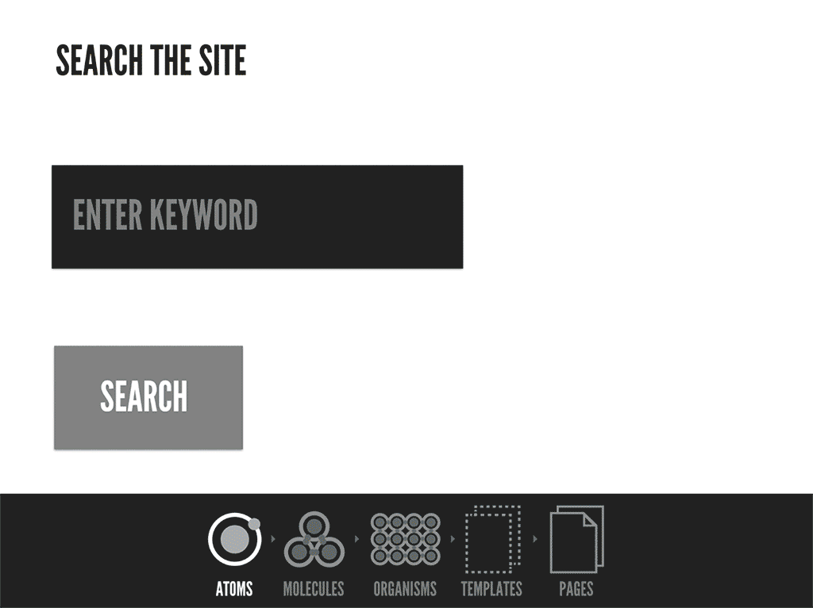

# 👉 React Architecture 및 패턴과 관련된 아티클

### 🎈 [리액트 설계 가이드](https://www.stevy.dev/react-design-guide)
#### 리액트 설계를 하는 원칙
1. 우리는 **확장성**있고 **재사용성** 있는 코드를 만들어야 한다
2. 관심사에 따라서 코드를 분리하고 **단일 책임**을 가지는 컴포넌트를 만들어야 한다
3. 외부에 **제어를 위임**시켜야 한다

컴포넌트의 사전적 정의에 따르면 컴포넌트는 **재사용성**과 **범용성**을 위해서 만들어져야 한다.   

리액트 컴포넌트를 딱 한가지 역할만 수행시키기 위해 설계 하기 위해서는 순수함수의 특성과 같이 동일한 **props**를 받으면 같은 JSX 리턴하는 순수함수로 이뤄져야 한다. 잘 격리되고 역할이 잘 정의해서 컴포넌트를 만들면 코드가 너무 광범위한 역할을 수행하고 복잡해지는 걸 방지해 준다. 단일 책임을 가지는 순수 컴포넌트들은 테스트하기 좋고 가독성도 좋다.   

제어를 외부에 위임 할수록 컴포넌트의 유연성과 재사용성이 높아진다. 반면, 제어를 위임하면 할수록 위임한 코드를 사용 하는 코드에 대한 이해 난이도가 높아 가고, 가독성이 떨어진다는 문제도 있다. 위임과 사용 용이성의 중심을 잘 잡는게 중요하다.   

관심사에 따른 분리와 재사용성의 확대를 위해 제어 위임을 적절하게 하고 또, 너무 어렵지 않게 사용성도 높이는 그 사이의 최적을 찾아내는게 개발자의 몫인 것 같다.

### 🎈 [유용한 리액트 패턴 5가지](https://velog.io/@dnr6054/%EC%9C%A0%EC%9A%A9%ED%95%9C-%EB%A6%AC%EC%95%A1%ED%8A%B8-%ED%8C%A8%ED%84%B4-5%EA%B0%80%EC%A7%80)

> 원본: [5 Advanced React Patterns](https://javascript.plainenglish.io/5-advanced-react-patterns-a6b7624267a6)

- 어떻게 하면 **재사용가능한 컴포넌트**를 각각 다른 use case들에 맞도록 만들 수 있을까?
- 어떻게 하면 컴포넌트를 **간단한 API**로 쓰기 쉽게 만들 수 있을까?
- 어떻게 하면 UI와 기능성의 측면에서 **확장 가능한** 컴포넌트를 만들 수 있을까?

우리가 잘 설계된 컴포넌트를 구현하기 위해서 흔히 객체 지향에서 이야기하는 "중복하지마라"라는 DRY 원칙을 따라야 하는데, 그럴려면 재사용가능한 컴포넌트를 만들어야 된다. 그 재사용가능한 컴포넌트를 만들려면 우리가 각각 다른 use case에 맞게 만들어야 하고 그에 따라 컴포넌트에 간단한 API 쓰기 쉽게 만들어야 한다.   

컴포넌트를 간단한 API로 쓰기 쉽게 만들기 위해서 좀 더 유연하고 융통성있는 컴포넌트를 만들어야 하는데 그러한 관련된 패턴들도 굉장히 많다. 그 패턴들의 기본적인 개념의 베이스는 IoC(제어의 역전)이 발판으로 되어 있는데, 해당 컴포넌트에게 제어권을 넘주고 흐름에 맞게 통제? 또는 해당 로직을 구현하고 이 흐름에 대한 호출은 외부 라이브러리가 해주는 방식으로 간단한 API를 만들 수 있으며 재사용가능한 컴포넌트를 만들 수 있다.   

흔히 많이 사용하고 있는 커스텀 훅도 예를 들수가 있는데 이 커스텀 훅을 생성하여 사용하면 로직을 분리할 수 있으며 저희는 이 훅으로 컴포넌트에 가져다 해당 컴포넌트에 맞게 사용할 수 있다. 따라서 제어권을 컴포넌트가 가지고 있고 해당 통제권?을 넘겨주어 해당 컴포넌트에서 호출하는 것이 아닌 해당 컴포넌트 밖에서 호출하게 하여 관심사를 분리함으로써 컴포넌트를 재사용할 수 있다고 생각한다.

### 🎈 [리액트 어플리케이션 구조 - 아토믹 디자인](https://ui.toast.com/weekly-pick/ko_20200213)
- [원문](https://andela.com/insights/structuring-your-react-application-atomic-design-principles/)

아토믹 디자인은 사용자 인터페이스를 작고 단순한 요소로 분리하는 개념이며, 일관된 UI를 만들고 유지보수성을 향상시켜준다.   

웹 사이트의 구성 블록이 HTML 요소들이며, 이 요소들은 원자라고 볼 수 있다. 원자가 결합되어 분자가 되는 것처럼 HTML 요소들은 결합되어 복잡한 페이지를 형성한다. 마찬가지로 각 페이지는 컴포넌트(또는 HTML 요소)로 분해될 수 있으며, 분해된 컴포넌트는 화학에서 가르치는 분자, 유기체와 유사하다.   

**원자**는 버튼, 제목, 텍스트 입력 필드와 같은 가장 작은 구성 컴포넌트이다. 원자는 모든 컴포넌트들의 기초가 되는 블록이며, **더 이상 분해 될 수 없는 필수 요소**이다. **분자**는 2개 이상의 원자로 구성되어 있으며, 하나의 단위로 함께 동작하는 **UI 컴포넌트들의 단순한 그룹**이다. 예를 들어 HTML 텍스트 입력 필드, 레이블, 오류 메세지 또는 HTML 텍스트 입력 필드와 버튼으로 구성된 검색 컴포넌트가 있다. **유기체는 분자, 원자 또는 다른 유기체의 그룹으로 구성**된 비교적 복잡한 그룹이다. 이 유기체들은 인터페이스의 개별적인 영역을 형성한다.   

템플릿은 컴포넌트들을 배치하고 설계의 구조를 보여준다. 페이지의 실제 컴포넌트가 없을 경우, 페이지가 어떻게 보일지에 대한 골격 구조이다. 페이지는 실제 컨텐츠들을 배치한 UI를 보여주며, 템플릿의 구체화된 인스턴스이다. 템플릿과 페이지는 유기체, 분자, 원자를 포함하고 있다. 이러한 작은 구성 요소들의 결합은 어플리케이션에서 사용자 인터페이스를 구성한다.   

#### 장점
어플리케이션과 분리하여 컴포넌트를 개발하고 테스트할 수 있으며, 스타일 가이드와 같은 도구에서 볼 수 있다. 그리고 통합 개발을 할 때, 백엔드 어플리케이션의 로직에 의존하지 않는다는 장점이 있다.   

일련의 패턴이 확립되면, 설계 변경이 필요한 경우에 대비하여 더 빠르고 유연성 있는 빌드 프로세스를 가질 수 있다. 또한 기존의 컴포넌트들을 재사용하고 있기 때문에 디자인을 일관성 있게 통일할 수 있다.   

특정 컴포넌트에 CSS가 강하게 결합되어 있기 때문에 CSS를 훨씬 잘 관리할 수 있다. 이를 위해서는 어플리케이션의 구조에 따라 컴포넌트에서 사용되는 CSS만 렌더링하도록 해야 한다.   

#### 단점
컴포넌트가 분리되어 있고 상위 컨테이너 컴포넌트의 사이즈를 결정할 수 없을 경우, 미디어쿼리를 사용하기 어렵다. 컴포넌트는 너비에 대해 알 수 없기 때문에 실제 페이지의 사이즈가 변경될 때 크기가 조정된다.   

이 문제는 크기를 조정할 수 있는 flex, grid 와 같은 CSS 속성을 구현한 레이아웃 컴포넌트를 도입하여 해결 할 수 있다.   

#### 마무리
뷰와 비즈니스 로직을 분리하는 것(관심사의 분리)이 좋은 방법이다. 이렇게 하면 프로젝트가 확장될 때 코드에서 문제를 디버깅하기 더 쉽다.   

어플리케이션의 컴포넌트들은 동일한 색상과 크기를 가진 빈 병이라고 할 수 있다. 각각의 병을 다른 색으로 채운다고 생각해보자. 이 과정은 컴포넌트의 상태를 업데이트하는 것으로 비유할 수 있다. 빈 병에 색을 채우는 것은 쉬운 일이고, 색을 바꾸는 상태 변경이 있더라도 빈 병에 넣을 색을 변경하는 것이기 때문에 쉬운 과정이 될 것이다.   

하지만 만약 병을 빨간 색으로 반쯤 채우고 다른 색으로 나머지를 채운다고 한다면 문제가 있을 것이다. 그 색이 잘 섞이지 않는다면? 또는 원래의 색을 제거하고 다른색으로 대체해야한다면? 이것은 비즈니스 로직을 구현할 때도 발생할 수 있는 문제로 코드 리팩터링과 컴포넌트 재사용을 어렵게 만든다.   

### 📌 참고 링크

- [React로 사고하기 - 공식 문서](https://ko.reactjs.org/docs/thinking-in-react.html)
- [Making good component design decisions in React](https://marvelapp.com/blog/making-good-component-design-decisions-in-react/)
- [React Clean Architecture](https://dev.to/kpiteng/react-clean-architecture-114f?utm_source=dormosheio&utm_campaign=dormosheio&fbclid=IwAR3E77zXUJT0TuDbOiNb6KvcYStKA3dWsNm--5S0_fN5TydqbCGOt48tVLk)
- [React Folder Structure in 5 Steps](https://smoh.tistory.com/385)
