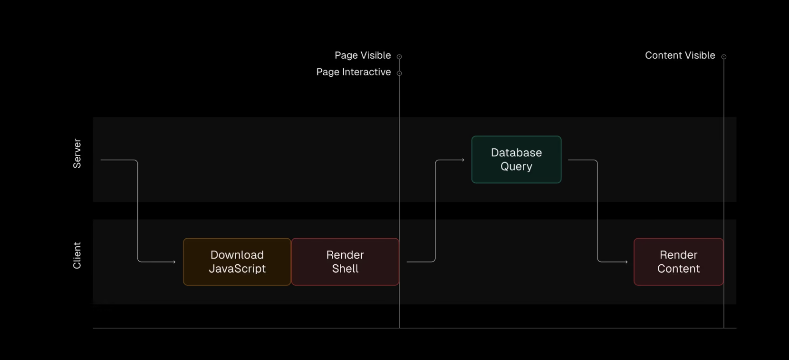
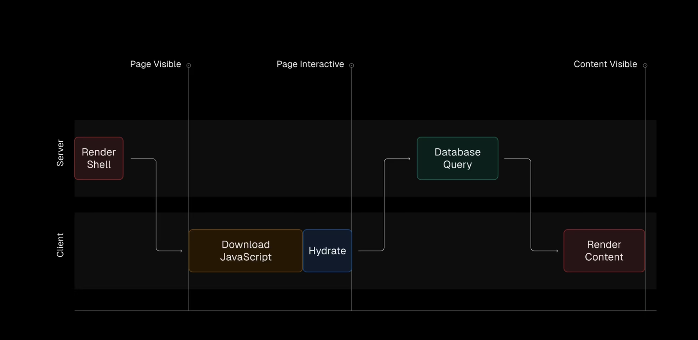
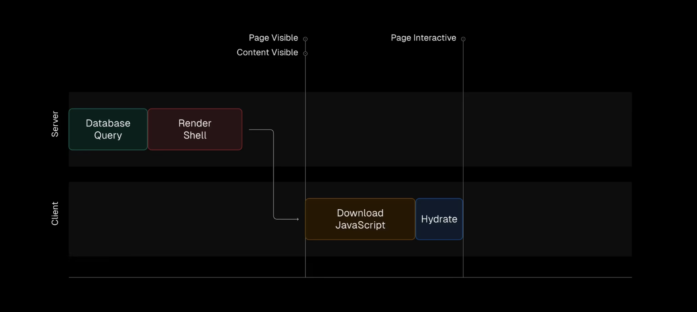

# React 렌더링이 진화의 과정

React는 사용자에게 최소한의 HTML을 제공하는 클라이언트 측 렌더링(CSR)으로 시작되었다.

```html
<!DOCTYPE html>
<html>
  <body>
    <div id="root"></div>
    <script src="/static/js/bundle.js"></script>
  </body>
</html>
```

스크립트에는 React, third-party dependencies 및 모든 애플리케이션 코드 등 애플리케이션에 대한 모든 것이 포함된다. 애플리케이션이 커짐에 따라 번들 크기도 커졌다. JavaScript가 다운로드되어 구문 분석된 후 React가 DOM 요소를 빈 `div`에 로드한다. 이 작업이 진행되는 동안 사용자에게 보이는 것은 빈 페이지뿐이다.   

드디어 초기 UI가 표시되더라도 페이지 내용이 여전히 누락되어 스켈레톤 로딩이 인기를 얻은 이유이다. 그런 다음 데이터를 가져오고 UI가 두 번째로 렌더링하여 로딩 스켈레톤을 실제 콘텐츠로 대체한다.   



React는 첫 번째 렌더링을 서버로 옮기는 Server-Side Rendering(SSR)으로 개선되었다. 사용자에게 제공된 HTML은 더 이상 비어 있지 않았고, 사용자가 초기 UI를 보는 속도가 개선되었음. 그러나 실제 콘텐츠를 표시하려면 여전히 데이터를 가져와야 한다.   



React Server Components(RSC)의 탄생으로, React에서 처음으로 네이티브로 UI가 렌더링되고 사용자에게 표시되기 전에 데이터를 가져올 수 있게 되었다.   

```tsx
// server component
export default async function Page() {
  const res = await fetch("https://api.example.com/products");
  const products = res.json();

  return (
    <>
      <h1>Products</h1>
      {products.map((product) => (
        <div key={product.id}>
          <h2>{product.title}</h2>
          <p>{product.description}</p>
        </div>
      ))}
    </>
  );
}
```

사용자에게 제공되는 HTML은 첫 번째 렌더링 시 실제 콘텐츠로 완전히 채워지므로 추가 데이터를 가져오거나 두 번째로 렌더링할 필요가 없어졌다.   



> https://vercel.com/blog/whats-new-in-react-19#server-components
