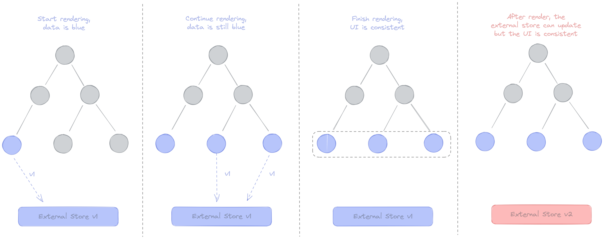

## 👉 React 18 변경점

### 🎈 `useId`
`useId`는 클라이언트와 서버간의 hydration의 mismatch를 피하면서 유니크한 아이디를 생성할 수 있는 새로운 hook입니다. 이는 주로 고유한 `id`가 필요한 접근성 API와 사용되는 컴포넌트에 유용할 것으로 기대됩니다.   

아이디는 기본적으로 트리 내부의 노드의 위치를 나타내는 base 32 문자열입니다. 트리가 여러 children으로 분기될 때마다, 현재 레벨에서 자식 수준을 나타내는 비트를 시퀸스 왼쪽에 추가하게 됩니다,.   

`useId`는 목록에서 키를 생성하기 위한 것이 아닙니다. 키는 데이터에서 생성되어야 합니다.   

### 🎈 `useTransition`

이 두 메소드를 사용하면 일부 상태 업데이트를 긴급하지 않은 것(not urgent)로 표시할 수 있습니다. 이것으로 표시되지 않은 상태 업데이트는 긴급한 것으로 간주됩니다. 긴급한 상태 업데이트가 긴급하지 않은 상태 업데이트을 중단할 수 있습니다.   

상태 업데이트를 긴급한 것과 긴급하지 않은 것으로 나누어 개발자에게 렌더링 성능을 튜닝하는데 많은 자유를 주었다고 볼 수 있습니다.

```tsx
function App() {
  const [resource, setResource] = useState(initialResource)
  const [isPending, startTransition] = useTransition({ timeoutMs: 3000 })
  return (
    <>
      <button
        disabled={isPending}
        onClick={() => {
          startTransition(() => {
            const nextUserId = getNextId(resource.userId)
            setResource(fetchProfileData(nextUserId))
          })
        }}
      >
        Next
      </button>
      {isPending ? 'Loading...' : null} 
      <ProfilePage resource={resource} />
    </>
  )
}
```

- `startTransition`는 함수로, 리액트에 어떤 상태변화를 지연시키고 싶은지 지정할 수 있습니다.
- `isPending`은 진행 여부로, 트랜지션이 진행중인지 알 수 있습니다.
- `timeoutMs` 프로퍼티는 트랜지션이 완료될 때까지 얼마나 오랫동안 기다릴 것인지 결정합니다. `{timeoutMs: 3000}` 를 전달한다면 “다음 프로필을 불러오는 데 3초보다 오래 걸린다면 로딩 상태를 보여주고 그전까진 계속 이전 화면을 보여줘도 괜찮아”라는 의미입니다.

`useTransition` 같은 API를 사용하면 원하는 사용자 경험에 초점을 맞출 수 있고 어떻게 구현했는지 생각하지 않아도 됩니다.


```jsx
const initialResource = fetchUserAndPosts();

function ProfilePage() {
  const [resource, setResource] = useState(initialResource);

  function handleRefreshClick() {
    setResource(fetchUserAndPosts());
  }

  return (
    <Suspense fallback={<h1>Loading profile...</h1>}>
      <ProfileDetails resource={resource} />
      <button onClick={handleRefreshClick}>
        Refresh
      </button>
      <Suspense fallback={<h1>Loading posts...</h1>}>
        <ProfileTimeline resource={resource} />
      </Suspense>
    </Suspense>
  );
}
```

이 예시에선 페이지가 로드되거나 “Refresh” 버튼을 누를 때 마다 데이터를 가져옵니다.   
`fetchUserAndPosts()`의 반환값을 상태에 저장하여 하위 컴포넌트들이 요청에서 가져온 데이터를 읽을 수 있게 하겠습니다.   
`<ProfileDetails>` 및 `<ProfileTimeline>` 컴포넌트는 새로운 데이터를 나타내는 새로운 리소스 prop을 수신하고 아직 응답이 없기 때문에 "suspend"되고 fallback이 표시됩니다.   
하지만 위 경험은 자연스럽지 않습니다. 우리는 한 페이지를 브라우징하고 있었는데 버튼을 클릭한 직후에 바로 로딩 상태로 전환되어 사용자를 혼란스럽게 합니다. 이전처럼, **의도치 않은 로딩 상태를 숨기기 위해서 상태 갱신을 트랜지션에 래핑할 수 있습니다.**   

```jsx
function ProfilePage() {
  const [isPending, startTransition] = useTransition({
    // Wait 10 seconds before fallback
    timeoutMs: 10000
  });
  const [resource, setResource] = useState(initialResource);

  function handleRefreshClick() {
    startTransition(() => {
      setResource(fetchProfileData());
    });
  }

  return (
    <Suspense fallback={<h1>Loading profile...</h1>}>
      <ProfileDetails resource={resource} />
      <button
        onClick={handleRefreshClick}
        disabled={isPending}
      >
        {isPending ? "Refreshing..." : "Refresh"}
      </button>
      <Suspense fallback={<h1>Loading posts...</h1>}>
        <ProfileTimeline resource={resource} />
      </Suspense>
    </Suspense>
  );
}
```

“Refresh” 버튼을 클릭해도 우리가 브라우징하고 있는 페이지가 사라지지 않습니다. 우리는 인라인으로 뭔가 로딩되고 있다는 것을 보고 데이터가 준비된 이후에 새로운 데이터가 보입니다.   

이제 `useTransition`의 필요성이 매우 일반적이라는 걸 알 수 있습니다. 사용자가 상호작용하는 대상을 실수로 숨기지 않도록 컴포넌트를 서스펜드 상태로 만들 수 있는 대부분 버튼 클릭이나 상호작용은 `useTransition`으로 래핑해야 합니다.   

위 작업은 컴포넌트 사이에 많은 반복적인 코드 생산으로 이어질 수 있습니다. 이것이 일반적으로 디자인 시스템에 `useTransition` 사용하는 것을 추천하는 이유입니다. 예를 들어 트랜지션 로직을 커스텀 `<Button>` 컴포넌트로 추출할 수 있습니다.   

```jsx
function Button({ children, onClick }) {
  const [isPending, startTransition] = useTransition({
    timeoutMs: 10000
  });

  function handleClick() {
    startTransition(() => {
      onClick();
    });
  }

  const spinner = (
    <span className="DelayedSpinner">
      {/* ... */}
    </span>
  );

  return (
    <>
      <button
        onClick={handleClick}
        disabled={isPending}
      >
        {children}
      </button>
      {isPending ? spinner : null}
    </>
  );
}
```

명심하세요. 버튼은 어떤 상태를 갱신하던지 관여하지 않습니다. 이것은 `onClick` 이벤트 핸들러에서 발생하는 모든 상태 갱신을 `transition`에 포함합니다. 이제 `<Button>`이 트랜지션 설정을 대신해 주기 때문에 `<ProfilePage>` 컴포넌트에 트랜지션 설정을 해줄 필요가 없습니다.   

```jsx
function ProfilePage() {
  const [resource, setResource] = useState(initialResource);

  function handleRefreshClick() {
    setResource(fetchProfileData());
  }

  return (
    <Suspense fallback={<h1>Loading profile...</h1>}>
      <ProfileDetails resource={resource} />
      <Button onClick={handleRefreshClick}>
        Refresh
      </Button>
      <Suspense fallback={<h1>Loading posts...</h1>}>
        <ProfileTimeline resource={resource} />
      </Suspense>
    </Suspense>
  );
}
```

버튼을 클릭하면 트랜지션이 시작되고 그 안에 `props.onClick()` 이 호출되서 `<ProfilePage>` 컴포넌트에서 `handleRefreshClick` 함수가 실행됩니다. 새로운 데이터를 가져오기 시작하지만 트랜지션 내부라서 폴백이 보여지지 않으며 `useTransition` 호출에 지정된 10초가 지나지 않았습니다. 트랜지션이 보류중인 동안 버튼에 인라인으로 로딩 인디케이터를 봅니다.   

이제 컨커런트 모드가 컴포넌트의 격리 수준 및 모듈성을 희생하지 않고도 우수한 사용자 경험을 만드는지 배웠습니다. React는 트랜지션을 조정합니다.

### 🎈 [`useDeferredValue`](https://reactjs.org/docs/hooks-reference.html#usedeferredvalue)
`useDeferredValue`를 사용하면, 트리에서 급하지 않은 부분의 재랜더링을 지연할 수 있습니다. 이는 `debounce`와 비슷하지만, 몇가지 더 장점이 있습니다. 고정된 지연시간이 없으므로, 리액트는 첫번째 렌더링이 반영되는 즉시 지연 렌더링을 시도합니다. 이 지연된 렌더링은 인터럽트가 가능하며, 사용자 입력을 차단하지 않습니다.

```js
const deferredValue = useDeferredValue(value);
```

`useDeferredValue`값을 수락하고 더 긴급한 업데이트를 연기할 값의 새 복사본을 반환합니다. 현재 렌더링이 사용자 입력과 같은 긴급 업데이트의 결과인 경우 React는 이전 값을 반환한 다음 긴급 렌더링이 완료된 후 새 값을 렌더링합니다.   

이 hook은 디바운싱 또는 throttling을 사용하여 업데이트를 연기하는 user-space hooks와 유사합니다.   

`useDeferredValue` 사용의 이점은 React가 다른 작업이 완료되는 즉시 업데이트 작업을 수행하고(임의의 시간을 기다리는 대신) `startTransition`과 같이 지연된 값이 기존 콘텐츠에 대한 예기치 않은 대체를 트리거하지 않고 일시 중단될 수 있다는 것입니다.

#### Memoizing deferred children
`useDeferredValue`는 전달한 값만 연기합니다. 긴급(urgent) 업데이트 중에 자식 컴포넌트가 다시 렌더링되는 것을 방지하려면 해당 컴포넌트도 `React.memo` 또는 `React.useMemo`로 memoize해야 합니다.

```jsx
function Typeahead() {
  const query = useSearchQuery('');
  const deferredQuery = useDeferredValue(query);

  // Memoizing tells React to only re-render when deferredQuery changes,
  // not when query changes.
  const suggestions = useMemo(() =>
    <SearchSuggestions query={deferredQuery} />,
    [deferredQuery]
  );

  return (
    <>
      <SearchInput query={query} />
      <Suspense fallback="Loading results...">
        {suggestions}
      </Suspense>
    </>
  );
}
```

자식을 memoize하면 React는 `query`가 변경될 때가 아니라 `deferredQuery`가 변경될 때만 다시 렌더링하면 됩니다.   
이 주의 사항은 `useDeferredValue`에만 있는 것이 아니며 디바운싱 또는 throttling을 사용하는 유사한 hook에 사용하는 것과 동일한 패턴입니다.

### 🎈 [`useSyncExternalStore`](https://reactjs.org/docs/hooks-reference.html#usesyncexternalstore)(Library Hooks)

> Library Hooks는 라이브러리 작성자가 라이브러리를 React 모델에 깊이 통합할 수 있도록 제공되며 일반적으로 애플리케이션 코드에서는 사용되지 않습니다.

```js
const state = useSyncExternalStore(subscribe, getSnapshot[, getServerSnapshot]);
```

`useSyncExternalStore`은 선택적 hydration 및 시간 분할과 같은 concurrent rendering 기능과 호환되는 방식으로 외부 데이터 소스에서 읽고 subscribing하는 데 권장되는 hook입니다.    

외부 데이터에 대한 원본에 대한 subscription을 필요로 할 때 더 이상 `useEffect`가 필요하지 않고, 이는 리액트 외부 상태와 통합되는 모든 라이브러리에 권장된다.   

이 메서드는 store 값을 반환하고 세 가지 인수를 허용합니다.
- `subscribe`: 스토어가 변경될 때마다 호출되는 콜백을 등록하는 함수입니다.
- `getSnapshot`: store의 현재 값을 반환하는 함수입니다.
- `getServerSnapshot`: 서버 렌더링 중에 사용된 스냅샷을 반환하는 함수입니다.

가장 기본적인 예는 단순히 전체 store를 subscription하는 것입니다.

```js
const state = useSyncExternalStore(store.subscribe, store.getSnapshot);
```

다음과 같이 특정 필드를 구독할 수도 있습니다.

```js
const selectedField = useSyncExternalStore(
  store.subscribe,
  () => store.getSnapshot().selectedField,
);
```

서버 렌더링 시 서버에서 사용하는 스토어 값을 직렬화하여 `useSyncExternalStore`에 제공해야 합니다. React는 서버 불일치를 방지하기 위해 hydration 중에 이 스냅샷을 사용합니다.

```js
const selectedField = useSyncExternalStore(
  store.subscribe,
  () => store.getSnapshot().selectedField,
  () => INITIAL_SERVER_SNAPSHOT.selectedField,
);
```

- External Store: 외부 스토어라는 것은 우리가 subscribe하는 무언가를 의미합니다. 예를 들어 리덕스 스토어, 글로벌 변수, dom 상태 등이 될 수 있습니다.
- Internal Store: `props`, `context`, `useState`, `useReducer` 등 리액트가 관리하는 상태를 의미합니다.
- [Tearing](https://github.com/reactwg/react-18/discussions/69): 시각적인 비일치를 의미한다. 예를 들어, 하나의 상태에 대해 UI가 여러 상태로 보여지고 있는, (= 각 컴포넌트 별로 업데이트 속도가 달라서 발생하는) UI가 찢어진 상태를 의미합니다.

> 리액트 18 이전에는 이러한 문제가 없었다. 그러나 리액트 18부터 도입된 concurrent 렌더링이 등장하며서 렌더링이 렌더링을 잠시 일시중지할 수 있게 되면서 이 문제가 대두되기 시작했다. 일시중지가 발생하는 사이에 업데이트는 렌더링에 사용되는 데이터와 이와 관련된 변경사항을 가져올 수 있게 되었다. 이로 인해 UI는 동일한 데이터에 다른 값을 표시할 수 있게 되버렸다.

아래와 같이 기존의 동기 렌더링 시에는 UI는 항상 일관성을 유지할 수 있었습니다.



그러나 concurrent 렌더링에서는 초기에는 아래 그림처럼 파란색입니다. 리액트는 외부 스토어가 바뀌면서 빨간색으로 업데이트 합니다. 리액트는 계속해서 컴포넌트를 빨간색으로 바꾸려고 시도할 것입니다. 이 과정에서 발생하는 UI의 불일치를 `tearing`이라고 합니다.


```js
import React, { useState, useEffect, useCallback } from 'react'

// library code

const createStore = (initialState) => {
  let state = initialState
  const getState = () => state
  const listeners = new Set()
  const setState = (fn) => {
    state = fn(state)
    listeners.forEach((l) => l())
  }
  const subscribe = (listener) => {
    listeners.add(listener)
    return () => listeners.delete(listener)
  }
  return { getState, setState, subscribe }
}

const useStore = (store, selector) => {
  const [state, setState] = useState(() => selector(store.getState()))
  useEffect(() => {
    const callback = () => setState(selector(store.getState()))
    const unsubscribe = store.subscribe(callback)
    callback()
    return unsubscribe
  }, [store, selector])
  return state
}

//Application code

const store = createStore({ count: 0, text: 'hello' })

const Counter = () => {
  const count = useStore(
    store,
    useCallback((state) => state.count, []),
  )
  const inc = () => {
    store.setState((prev) => ({ ...prev, count: prev.count + 1 }))
  }
  return (
    <div>
      {count} <button onClick={inc}>+1</button>
    </div>
  )
}

const TextBox = () => {
  const text = useStore(
    store,
    useCallback((state) => state.text, []),
  )
  const setText = (event) => {
    store.setState((prev) => ({ ...prev, text: event.target.value }))
  }
  return (
    <div>
      <input value={text} onChange={setText} className="full-width" />
    </div>
  )
}

const App = () => {
  return (
    <div className="container">
      <Counter />
      <Counter />
      <TextBox />
      <TextBox />
    </div>
  )
}
```

`useState`, `useEffect`를 사용하고 있는 `useStore` hook을 `useSyncExternalStore`로 변경해볼 수 있습니다.

```js
import { useSyncExternalStore } from 'react'

const useStore = (store, selector) => {
  return useSyncExternalStore(
    store.subscribe,
    useCallback(() => selector(store.getState(), [store, selector])),
  )
}
```

코드가 훨씬 간결해졌습니다. 그러면 어떤 라이브러리들이 이러한 concurrent rendering에 영향을 받을까?

렌더링 중에 외부 가변 데이터에 접근하지 않고, react props, state, context 만을 사용하여 정보를 전달하는 컴포넌트와 훅만 가지고 있는 라이브러리라면 영향을 받지 않을 것입니다.   
데이터 fetch, 상태관리, redux, mobx, relay 등은 영향을 받을 것입니다. 이는 리액트 외부에 상태를 저장하기 때문입니다. concurrent 렌더링 시에는 react가 모르게 렌더링 중에 이러한 값이 업데이트 될 수 있기 때문입니다.

> 참고: https://github.com/reactwg/react-18/discussions/86   
> 참고: https://www.youtube.com/watch?v=oPfSC5bQPR8&t=694s&ab_channel=ReactConf2021
> `getSnapShot`은 캐시된 값을 반환해야 합니다. `getSnapshot`이 연속으로 여러 번 호출되면 그 사이에 스토어 업데이트가 없는 한 정확히 동일한 값을 반환해야 합니다.

### 🎈 `useInsertionEffect`(Library Hooks)

```js
useInsertionEffect(didUpdate);
```

signature는 `useEffect`와 동일하지만, 모든 DOM 변형 전에 동기적으로 실행됩니다. `useLayoutEffect`에서 레이아웃을 읽기 전에 DOM에 스타일을 삽입하려면 이것을 사용하십시오. 이 hook는 범위가 제한되어 있으므로 이 hook는 refs에 접근할 수 없으며 업데이트를 예약할 수 없습니다.

> `useInsertionEffect`는 css-in-js 라이브러리 작성자로 제한되어야 합니다. 대신 `useEffect` 또는 `useLayoutEffect`를 사용하세요.

## Breaking Change

### [Automatic batching](https://reactjs.org/blog/2022/03/29/react-v18.html#new-feature-automatic-batching)

> https://github.com/reactwg/react-18/discussions/21

batching은 더 나은 성능을 위해 React가 여러 상태 업데이트를 단일 재렌더링으로 그룹화하는 것입니다. 예를 들어 동일한 클릭 이벤트 내에 두 개의 상태 업데이트가 있는 경우 React는 항상 이를 하나의 재렌더링으로 일괄 처리합니다.

React Batch 업데이트 방식을 변경하여 자동으로 더 많은 배치를 수행할 수 있도록 성능이 향상되었다. 여기서 batching이란 여러 상태 업데이트를 하나의 리렌더링으로 처리하여 성능을 향상시키는 방법입니다. 예를 들어, 버튼 하나 클릭이 두개의 상태를 업데이트 (useState가 두번 수행) 한다면, 리액트는 이를 하나의 리렌더링으로 처리할 수 있도록 해주는 것을 의미합니다.   

그러나 리액트는 언제 업데이트를 배치로 처리했는지가 일관성있게 이뤄지고 있지 않았습니다. 예를 들어 데이터를 fetch 한 다음, handleClick 에서 상태를 업데이트 하는 경우, 리액트는 업데이트를 배치하지 않고 개별 업데이트 두개를 수행하곤 했었습니다. 그 이유는 브라우저 이벤트 중에는 배치로 일괄 처리 하지만, 이벤트가 이미 처리된 후(콜백)에서 상태를 업데이트 처리하고 있었기 때문이였습니다.   

리액트 18의 automatic batching은 createRoot가 있는 React 18부터 모든 업데이트는 출처에 관계없이 자동으로 일괄 처리됩니다. 어디에서 이벤트가 발생했는지와 상관없이 자동으로 모든 업데이트가 배치되어 이뤄집니다.   

즉, timeouts, promises, native 이벤트 핸들러 또는 기타 이벤트 내부의 업데이트는 React 이벤트 내부의 업데이트와 동일한 방식으로 일괄 처리됩니다. 이로 인해 렌더링 작업이 줄어들고 애플리케이션의 성능이 향상될 것으로 기대합니다.

```js
function App() {
  const [count, setCount] = useState(0)
  const [flag, setFlag] = useState(false)

  function handleClick() {
    fetchSomething().then(() => {
      // React 18 and later DOES batch these:
      setCount((c) => c + 1)
      setFlag((f) => !f)
      // React will only re-render once at the end (that's batching!)
    })
  }

  return (
    <div>
      <button onClick={handleClick}>Next</button>
      <h1 style={{ color: flag ? 'blue' : 'black' }}>{count}</h1>
    </div>
  )
}
```

만약 이러한 동작을 원치 않는다면 `flushSync`를 쓰면 됩니다.

```js
import { flushSync } from 'react-dom'; // Note: react-dom, not react

function handleClick() {
  flushSync(() => {
    setCounter(c => c + 1);
  });
  // React has updated the DOM by now
  flushSync(() => {
    setFlag(f => !f);
  });
  // React has updated the DOM by now
}
```

> https://reactjs.org/blog/2022/03/29/react-v18.html   
> https://yceffort.kr/2022/04/react-18-changelog   
> https://ko.reactjs.org/docs/concurrent-mode-patterns.html
