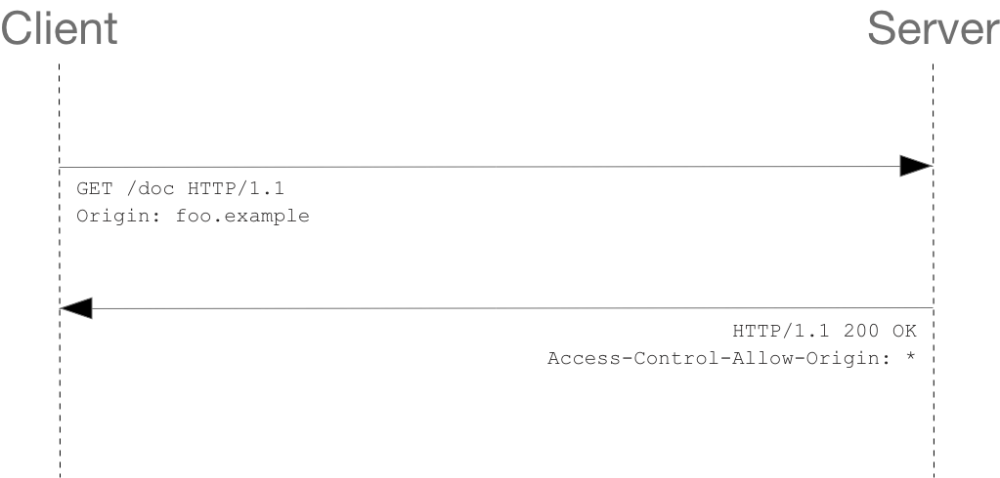

# 👉 [CORS는 왜 이렇게 우리를 힘들게 하는걸까?](https://evan-moon.github.io/2020/05/21/about-cors/)

## 💻 CORS에 대한 기본적인 내용
CORS는 Cross-Origin Resource Sharing의 줄임말로, 교차 출처 리소스 공유라고 한다.

### 🎈 출처(Origin)가 무엇인가요?

```
https://www.seungmin.com/users?sort=asc&page=1#foo

https:// => protocol
www.seungmin.com => Host
/users => path
?sort=asc&page=1 => Query String
#foo => Fragment
```

위에서 출처는 Protocol과 Host 그리고 `:80`, `:433`과 같은 포트 번호까지 모두 합친 것을 의미한다. 즉, 서버의 위치를 찾아가기 위해 필요한 가장 기본적인 것들을 합쳐놓은 것이다.   

우리는 브라우저의 개발자 도구의 콘솔에서 `Location` 객체가 가지고 있는 `origin` 프로퍼티데 접근함으로써 손 쉽게 어플리케이션이 실행되고 있는 출처를 알아낼 수도 있다.   

```js
console.log(location.origin);
```

### 🎈 SOP(Same-Origin Policy)
SOP는 지난 2011년, [RFC6454](https://datatracker.ietf.org/doc/html/rfc6454#page-5)에서 처음 등장한 보안 정책으로 **같은 출처에서만 리소스를 공유할 수 있는 규칙**을 가진 정책이다.   

그러나 웹이라는 오픈스페이스 환경에서 다른 출처에 있는 리소스를 가져와서 사용하는 일은 굉장히 흔한 일이라 무작정 막을 수도 없는 노릇이니 몇 가지 예외 조항을 두고 이 조항에 해당하는 리소스 요청은 출처가 다르더라도 허용하기로 했다. 그 중 하나가 CORS 정책을 지킨 리소스 요청이다.   

우리가 다른 출처로 리소스를 요청한다면 SOP 정책을 위반한 것이 되고, 거기다가 SOP의 예외 조항인 CORS 정책을 지키지 않는다면 아예 다른 출처의 리소스를 사용할 수 없게 되는 것이다.   

이렇게 출처가 다른 두 개의 어플리케이션을 마음대로 소통할 수 없게 하는 이유는 그러한 환경은 꽤나 위험한 환경이기 때문이다.   

당장 브라우저의 개발자 도구만 열어도 DOM이 어떻게 작성되었는지, 어떤 서버와 통신하는지, 리소스의 출처는 어디인지와 같은 정보들을 아무런 제재없이 볼 수 있다. 이러한 상황 속에서 다른 출처의 어플리케이션이 서로 통신하는 것에 대해 아무런 제약도 존재하지 않는다면, 악의를 가진 사용자가 소스 코드를 구경한 후 [CSRF(Cross-Site Request Forgery)](https://ko.wikipedia.org/wiki/%EC%82%AC%EC%9D%B4%ED%8A%B8_%EA%B0%84_%EC%9A%94%EC%B2%AD_%EC%9C%84%EC%A1%B0)나 [XSS(Cross-Site Scripting)](https://ko.wikipedia.org/wiki/%EC%82%AC%EC%9D%B4%ED%8A%B8_%EA%B0%84_%EC%8A%A4%ED%81%AC%EB%A6%BD%ED%8C%85)와 같은 방법을 사용하여 사용자의 정보를 탈취할 수 있기 때문이다.

### 🎈 같은 출처와 다른 출처의 구분
두 개의 출처가 서로 같다고 판단하는 로직 자체는 굉장히 간단한데, 두 URL의 구성 요소 중 `Scheme`, `Host`, `Port` 이 세 가지만 동일하면 된다. 예를 들어, `https://`라는 스킴에 `www.seungmin.com` 호스트를 가지고 있고 `:80`번 포트를 사용하고 있다는 것만 같으면 나머지는 전부 다르더라도 같은 출처로 인정된다.   

**이렇게 출처를 비교하는 로직이 서버에 구현된 스펙이 아니라 브라우저에 구현되어 있는 스펙이다.**   

만약 우리가 CORS 정책을 위반하는 리소스 요청을 하더라도 해당 서버가 같은 출처에서 보낸 요청만 받겠다는 로직을 가지고 있는 경우가 아니라면 서버는 정상적으로 응답하고, 이후 브라우저가 이 응답을 분석해서 CORS 정책 위반이라고 판단되면 그 응답을 사용하지 않고 그냥 버리는 순서인 것이다.   

> 서버는 CORS를 위반하더라도 정상적으로 응답을 해주고, 응답의 파기 여부는 브라우저가 결정한다

즉, CORS는 브라우저의 구현 스펙에 포함되는 정책이기 때문에 브라우저를 통하지 않고 서버 간 통신을 할 때는 이 정책이 적용되지 않는다. 또한 CORS 정책을 위반하는 리소스 요청 때문에 에러가 발생했다고 해도 서버 쪽 로그에는 정상적으로 응답을 했다는 로그만 남기 때문에, CORS가 돌아가는 방식을 정확히 모르면 에러 트레이싱에 난항을 겪을 수도 있다.   

## 💻 CORS는 어떻게 동작하나요?
기본적으로 웹 클라이언트 어플리케이션이 다른 출처의 리소스를 요청할 때는 HTTP 프로토콜을 사용하여 요청을 보내게 되는데, 이때 브라우저는 요청 헤더에 `Origin`이라는 필드에 요청을 보내는 출처를 함께 담아보낸다.

```http
Origin: https://www.seungmin.com
```

이후 서버가 이 요청에 대한 응답을 할 때 응답 헤더의 `Access-Control-Allow-Origin`이라는 값에 *이 리소스를 접근하는 것이 허용된 출처*를 내려주고, 이후 응답을 받은 브라우저는 자신이 보냈던 요청의 `Origin`와 서버가 보내준 응답의 `Access-Control-Allow-Origin`을 비교해본 후 이 응답이 유효한 응답인지 아닌지를 결정한다.   

기본적인 흐름은 간단하지만, CORS가 동작하는 방식은 한 가지가 아니라 세 가지의 시나리오에 따라 변경된다.   

### 🎈 [Preflight Request](https://developer.mozilla.org/ko/docs/Web/HTTP/CORS#%ED%94%84%EB%A6%AC%ED%94%8C%EB%9D%BC%EC%9D%B4%ED%8A%B8_%EC%9A%94%EC%B2%AD)
**프리플라이트(Preflight)** 방식은 일반적으로 우리가 웹 어플리케이션을 개발할 때 가장 마주치는 시나리오다. 이 시나리오에 해당하는 상황일 때 브라우저는 요청을 한번에 보내지 않고 예비 요청과 본 요청으로 나누어서 서버로 전송한다.   

우리가 자바스크립트의 `fetch` API를 사용하여 브라우저에게 리소스를 받아오라는 명령을 내리면 브라우저는 **서버에게 예비 요청을 먼저 보내고**, 서버는 이 예비 요청에 대한 응답으로 현재 자신이 어떤 것들을 허용하고, 어떤 것들을 금지하고 있는지에 대한 정보를 응답 헤더에 담아서 브라우저에게 다시 보내주게 된다.   

이후 브라우저는 자신이 보낸 예비 요청과 서버가 응답에 담아준 허용 정책을 **비교**한 후, 이 요청을 보내는 것이 **안전하다고 판단되면 같은 엔드포인트로 다시 본 요청을 보내게 된다.** 이후 서버가 이 본 요청에 대한 응답을 하면 브라우저는 최종적으로 이 응답 데이터를 자바스크립트에게 넘겨준다.   

이 플로우는 브라우저가 본 요청을 보내기 전에 `OPTIONS` 메소드를 사용하여 예비 요청을 보내는 것을 확인할 수 있다.   

<p align="center">
  
</p>

```http
OPTIONS /resources/post-here/ HTTP/1.1
Host: bar.other
User-Agent: Mozilla/5.0 (Macintosh; Intel Mac OS X 10.14; rv:71.0) Gecko/20100101 Firefox/71.0
Accept: text/html,application/xhtml+xml,application/xml;q=0.9,*/*;q=0.8
Accept-Language: en-us,en;q=0.5
Accept-Encoding: gzip,deflate
Connection: keep-alive
Origin: http://foo.example
Access-Control-Request-Method: POST
Access-Control-Request-Headers: X-PINGOTHER, Content-Type
```

실제로 브라우저가 보낸 요청을 보면, 단순히 `Origin`에 대한 정보 뿐만 아니라 자신이 예비 요청 이후에 보낼 본 요청에 대한 다른 정보들도 함께 포함되어 있는 것을 볼 수 있다.   

이 예비 요청에서 브라우저는 `Access-Control-Request-Headers`를 사용하여 자신이 본 요청에서 `Content-Type`, `X-PINGOTHER` 헤더를 사용할 것을 알려주거나, `Access-Control-Request-Method`를 사용하여 이후 `POST` 메소드를 사용할 것을 서버에게 미리 알려주고 있는 것이다.   

이렇게 서버에 예비 요청을 보내면, 이제 서버가 이 예비 요청에 대한 응답을 보내준다.   

```http
HTTP/1.1 204 No Content
Date: Mon, 01 Dec 2008 01:15:39 GMT
Server: Apache/2
Access-Control-Allow-Origin: https://foo.example
Access-Control-Allow-Methods: POST, GET, OPTIONS
Access-Control-Allow-Headers: X-PINGOTHER, Content-Type
Access-Control-Max-Age: 86400
Vary: Accept-Encoding, Origin
Keep-Alive: timeout=2, max=100
Connection: Keep-Alive
```

여기서 우리가 눈여겨 봐야할 것은 서버가 보내준 응답 헤더에 포함된 `Access-Control-Allow-Origin: https://foo.example`라는 값이다.   

서버에서 이 리소스에 접근이 가능한 출처는 오직 `https://foo.example`뿐이라고 브라우저에게 이야기해준 것이다.   

만약 CORS 정책을 위반했다면 다음과 같은 에러를 뱉게 되는 것이다.

```
🚨 Access to fetch at ‘https://foo.example’ from origin ‘https://bar.example’ has been blocked by CORS policy: 
Response to preflight request doesn’t pass access control check: 
The ‘Access-Control-Allow-Origin’ header has a value ‘https://foo.example’ that is not equal to the supplied origin. 
Have the server send the header with a valid value, or, 
if an opaque response serves your needs, 
set the request’s mode to ‘no-cors’ to fetch the resource with CORS disabled.
```

이때 예비 요청에 대한 응답에서 에러가 발생하지 않고 정상적으로 200이 떨어질 수 있는데, 콘솔 창에는 빨갛게 에러가 표시되기 때문에 많은 분들이 헷갈려하시는데, **CORS 정책 위반으로 인한 에러는 예비 요청의 성공 여부와 별 상관이 없다.** 브라우저가 CORS 정책 위반 여부를 판단하는 시점은 **예비 요청에 대한 응답을 받은 이후이기 때문이다.**   

물론 예비 요청 자체가 실패해도 똑같이 CORS 정책 위반으로 처리될 수도 있지만, 중요한 것은 예비 요청의 성공/실패 여부가 아니라 “응답 헤더에 유효한 `Access-Control-Allow-Origin` 값이 존재하는가”이다. 만약 예비 요청이 실패해서 200이 아닌 상태 코드가 내려오더라도 헤더에 저 값이 제대로 들어가있다면 CORS 정책 위반이 아니라는 의미이다.   

대부분의 경우 이렇게 예비 요청, 본 요청을 나누어 보내는 프리플라이트 방식을 사용하기는 하지만, 모든 상황에서 이렇게 두 번씩 요청을 보내는 것은 아니다. 조금 까다로운 조건이기는 하지만 어떤 경우에는 예비 요청없이 본 요청만으로 CORS 정책 위반 여부를 검사하기도 한다.   

### 🎈 [Simple Request](https://developer.mozilla.org/ko/docs/Web/HTTP/CORS#%EB%8B%A8%EC%88%9C_%EC%9A%94%EC%B2%ADsimple_requests)
단순 요청(Simple Request)은 예비 요청을 보내지 않고 바로 서버에게 본 요청부터 때려박은 후, 서버가 이에 대한 응답의 헤더에 `Access-Control-Allow-Origin`과 같은 값을 보내주면 그때 브라우저가 CORS 정책 위반 여부를 검사하는 방식이다. 즉, 프리플라이트와 단순 요청 시나리오는 전반적인 로직 자체는 같되, 예비 요청의 존재 유무만 다르다.   

<p align="center">
  
</p>

하지만 아무 때나 단순 요청을 사용할 수 있는 것은 아니고, 다음과 같은 특정 조건을 만족하는 경우에만 예비 요청을 생략할 수 있다.
1. 요청의 메소드는 `GET`, `HEAD`, `POST` 중 하나여야 한다.
2. `Accept`, `Accept-Language`, `Content-Language`, `Content-Type`, `DPR`, `Downlink`, `Save-Data`, `Viewport-Width`, `Width`를 제외한 헤더를 사용하면 안된다.
3. 만약 `Content-Type`를 사용하는 경우에는 `application/x-www-form-urlencoded`, `multipart/form-data`, `text/plain`만 허용된다.

사실상 이 조건들을 모두 만족시키는 상황을 만들기는 그렇게 쉽지 않다.   

### 🎈 [Credentialed Request](https://developer.mozilla.org/ko/docs/Web/HTTP/CORS#%EC%9D%B8%EC%A6%9D%EC%A0%95%EB%B3%B4%EB%A5%BC_%ED%8F%AC%ED%95%A8%ED%95%9C_%EC%9A%94%EC%B2%AD)
3번째 시나리오는 인증된 요청을 사용하는 방법이다. 이 시나리오는 CORS의 기본적인 방식이라기 보다는 다른 출처 간 통신에서 좀 더 보안을 강화하고 싶을 때 사용하는 방법이다.   

기본적으로 브라우저가 제공하는 비동기 리소스 요청 API인 `XMLHttpRequest` 객체나 `fetch` API는 별도의 옵션 없이 브라우저의 쿠키 정보나 인증과 관련된 헤더를 함부로 요청에 담지 않는다. 이때 요청에 인증과 관련된 정보를 담을 수 있게 해주는 옵션이 바로 `credentials` 옵션이다.   

이 옵션에는 총 3가지의 값을 사용할 수 있으며, 각 값들이 가지는 의미는 다음과 같다.   

|옵션 값|설명|
|:---:|:---|
|same-origin(기본값)|같은 출처 간 요청에만 인증 정보를 담을 수 있다.|
|include|모든 요청에 인증 정보를 담을 수 있다.|
|omit|모든 요청에 인증 정보를 담지 않는다.|

만약 `same-origin`이나 `include`와 같은 옵션을 사용하여 리소스 요청에 인증 정보가 포함된다면, 이제 브라우저는 다른 출처의 리소스를 요청할 때 단순히 `Access-Control-Allow-Origin`만 확인하는 것이 아니라 좀 더 빡빡한 검사 조건을 추가하게 된다.   

`Access-Control-Allow-Origin` 값으로 모든 출처를 허용한다는 의미인 `*`가 설정되어 있으면, 다른 출처에서 리소스를 요청할 때 CORS 정책 위반으로 인한 제약을 받지 않는다.   

브라우저는 인증 모드가 `include`일 경우, 모든 요청을 허용한다는 의미의 `*`를 `Access-Control-Allow-Origin` 헤더에 사용하면 안된다. 이처럼 요청에 인증 정보가 담겨있는 상태에서 다른 출처의 리소스를 요청하게 되면 브라우저는 CORS 정책 위반 여부를 검사하는 룰에 다음 두 가지를 추가하게 된다.

1. `Access-Control-Allow-Origin`에는 `*`를 사용할 수 없으며, 명시적인 URL이어야한다.
2. 응답 헤더에는 반드시 `Access_Control-Allow-Credentials: true`가 존재해야한다.

## 💻 CORS를 해결할 수 있는 방법

### 🎈 Access-Control-Allow-Origin 세팅하기
CORS 정책 위반으로 인한 문제를 해결하는 가장 대표적인 방법은, 그냥 정석대로 서버에서 `Access-Control-Allow-Origin` 헤더에 알맞은 값을 세팅해주는 것이다.   

이때 와일드카드인 `*`를 사용하여 이 헤더를 세팅하게 되면 모든 출처에서 오는 요청을 받아먹겠다는 의미이므로 당장은 편하지만, 보안적으로 심각한 이슈가 발생할 수 있다. 그렇기 때문에 가급적이면 명시적으로 출처를 명시해주는것이 좋다.   

### 🎈 Webpack Dev Server로 리버스 프록싱하기

사실 CORS를 가장 많이 마주치는 환경은 바로 로컬에서 프론트엔드 어플리케이션을 개발하는 경우라고 해도 과언이 아니다. 백엔드에는 이미 `Access-Control-Allow-Origin` 헤더가 세팅되어있겠지만, 이 중요한 헤더에다가 `http://localhost:3000` 같은 범용적인 출처를 넣어주는 경우는 드물기 때문이다.   

프론트엔드 개발자는 대부분 웹팩과 `webpack-dev-server`를 사용하여 자신의 머신에 개발 환경을 구축하게 되는데, 이 라이브러리가 제공하는 프록시 기능을 사용하면 아주 편하게 CORS 정책을 우회할 수 있다.   

```js
module.exports = {
  devServer: {
    proxy: {
      '/api': {
        target: 'https://api.seungmin.com',
        changeOrigin: true,
        pathRewrite: { '^/api': '' },
      },
    }
  }
}
```

뒤에서 웹팩이 `https://api.seungmin.com`으로 요청을 프록싱해주기 때문에 마치 CORS 정책을 지킨 것처럼 브라우저를 속이면서도 우리는 원하는 서버와 자유롭게 통신을 할 수 있다. 즉, 프록싱을 통해 CORS 정책을 우회할 수 있는 것이다.   
