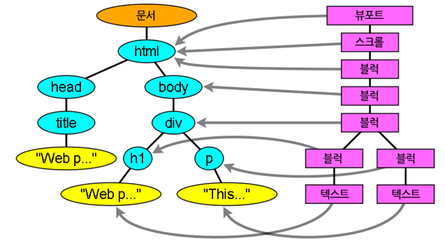
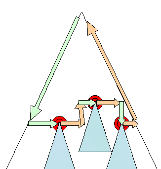

# 👉 [브라우저는 어떻게 동작하는가?](https://d2.naver.com/helloworld/59361)

## 💻 소개

### 🎈 브라우저의 주요 기능
브라우저의 주요 기능은 사용자가 선택한 자원을 서버에 요청하고 브라우저에 표시하는 것이다. 자원의 주소는 URI에 의해 정해진다.   

브라우저는 HTML과 CSS 명세에 따라 HTML 파일을 해석해서 표시하는데 이 명세는 웹 표준화 기구인 W3C에서 정한다.   

### 🎈 브라우저의 기본 구조
브라우저의 주요 구성 요소는 다음과 같다.   
1. 사용자 인터페이스 - 주소 표시줄, 이전/다음 버튼, 북마크 메뉴 등. 요청한 페이지를 보여주는 창을 제외한 나머지 모든 부분이다.
2. 브라우저 엔진 - 사용자 인터페이스와 렌더링 엔진 사이의 동작을 제어.
3. 렌더링 엔진 - 요청한 콘텐츠를 표시. 예를 들어 HTML을 요청하면 HTML과 CSS를 파싱하여 화면에 표시함.
4. 통신 - HTTP 요청과 같은 네트워크 호출에 사용됨.
5. UI 백엔드 - 콤보 박스와 창 같은 기본적인 장치를 그림. OS 사용자 인터페이스 체계를 사용.
6. 자바스크립트 해석기 - 자바스크립트 코드를 해석하고 실행.
7. 자료 저장소 - 이 부분은 자료를 저장하는 계층이다. 쿠키를 저장하는 것과 같은 모든 종료의 자원을 하드 디스크에 저장할 필요가 있다. HTML5 명세에는 브라우저가 지원하는 [웹 데이터 베이스](https://www.html5rocks.com/en/features/storage)가 정의되어 있다.

<p align="center">
  
</p>

## 💻 렌더링 엔진
렌더링 엔진의 역할은 요청 받은 내용을 **브라우저 화면에 표시하는 일**이다.   
렌더링 엔지는 HTML 및 XML 문서와 이미지를 표시할 수 있다.   

### 🎈 렌더링 엔진들
파이어폭스는 모질라에서 직접 만든 게코(Gecko) 엔진을 사용하고 사파리와 크롬은 웹킷(Webkit) 엔진을 사용한다.   

### 🎈 동작 과정
렌더링 엔진은 통신으로부터 요청한 문서의 내용을 얻은 것으로 시작하는데 문서의 내용은 보통 8KB 단위로 전송된다.   
다음은 렌더링 엔진의 기본적인 동작 과정이다.   

<p align="center">
  
</p>

렌더링 엔진은 HTML 문서를 파싱하고 *콘텐츠 트리* 내부에서 태크를 DOM 노드로 변환한다. 그 다음 외부 CSS 파일과 함께 포함된 스타일 요소도 파싱한다. 스타일 정보와 HTML 표시 규칙은 *렌더 트리*라고 부르는 또 다른 트리를 생성한다.   

렌더 트리는 색상 또는 면적과 같은 시각적 속성이 있는 사각형을 포함하고 있는데 정해진 순서대로 화면에 표시된다.   

렌더 트리 생성이 끝나면 배치가 시작되는데 이것은 각 노드가 화면에 정확한 위치에 표시되는 것을 의미한다. 다음은 UI 백엔드에서 렌더 트리의 각 노드를 가로지르며 형상을 민들어 내는 그리기 과정이다.   

렌더링 엔진은 좀 더 나은 사용자 경험을 위해 가능하면 빠르게 내용을 표시하는데 모든 HTML을 파싱할 때까지 기다리지 않고 배치와 그리기 과정을 시작한다. 네트워크로부터 나머지 내용이 전송되기를 기다리는 동시에 받은 내용의 일부를 먼저 화면에 표시하는 것이다.   

### 🎈 동작 과정 예
- 웹킷 동작 과정
*어태치먼트(attachment)* 는 웹킷이 렌더 트리를 생성하기 위해 DOM 노드와 시각 정보를 연결하는 과정이다.   

<p align="center">
  
</p>

- 모질라의 게코 렌더링 엔진 동작 과정

<p align="center">
  
</p>

## 💻 파싱과 DOM 트리 구축

### 🎈 파싱 일반
문서 파싱은 브라우저가 코드를 이해하고 사용할 수 있는 구조로 변환하는 것을 의미한다. 파싱 결과는 보통 문서 구조를 나타내는 노드 트리인데 파싱 트리 또는 문법 트리라고 부른다.

#### 문법
파싱은 문서에 작성된 언어 또는 형식의 규칙에 따르는데 파싱할 수 있는 모든 형식은 정해진 용어와 구문 규칙에 따라야 한다. 이것을 [문맥 자유 문법](https://ko.wikipedia.org/wiki/%EB%AC%B8%EB%A7%A5_%EC%9E%90%EC%9C%A0_%EB%AC%B8%EB%B2%95)이라고 한다. 인간의 언어는 이런 모습과 다르기 떄문에 기계적으로 파싱이 불가능하다.   

#### 파서-어휘 분석기 조합
파싱은 어휘 분석과 구문 분석이라는 두 가지로 구분할 수 있다.   

어휘 분석은 자료를 토큰으로 분해하는 과정이다. 토큰은 유효하게 구성된 단위의 집합체로 용어집이라고 할 수 있는데 인간의 언어로 말하자면 사전에 등장하는 모든 단어에 해당된다.   

구문 분석은 언어의 구문 규칙을 적용하는 과정이다.   

파서는 보통 두 가지 일을 하는데 자료를 유효한 토큰으로 분해하는 어휘 분석기가 있고 언어 구문 규칙에 따라 문서 구조를 분석함으로써 파싱 트리를 생성하는 파서가 있다. 어휘 분석기는 공백과 줄 바꿈 같은 의미 없는 문자를 제거한다.

<p align="center">
  
</p>

파싱 과정은 반복되고 파서는 보통 어휘 분석기로 새 토큰을 받아서 구문 규칙과 일치하는지 확인한다. 규칙에 맞으면 토큰에 해당하는 노드 파싱 트리에 추가되고 파서는 또 다른 토큰을 요청한다.   

규칙에 맞지 않으면 파서는 토큰을 내부적으로 저장하고 토큰과 일치하는 규칙이 발견될 때까지 요청한다. 맞는 규칙이 없는 경우 예외로 처리하는데 이것은 문서과 유효하지 않고 구문 오류를 포함하고 있다는 의미다.   

#### 변환
파서 트리는 최종 결과물이 아니다. 파싱은 보통 문서를 다른 양식으로 변환하는데 컴파일이 하나의 예가 된다. 소스 코드를 기계 코드로 만드는 컴파일러는 파싱 트리 생성 후 이를 기계 코드 문서로 변환한다.

<p align="center">
  
</p>

#### 파싱의 예
- 본문 참고

#### 어휘와 구문에 대한 공식적인 정의
어휘는 보통 정규 표현식으로 표현한다.   

```
INTEGER : 0|[1-9][0-9]*
PLUS : +
MINUS : -
```

구문은 보통 [BNF](https://ko.wikipedia.org/wiki/BNF)라고 부르는 형식에 따라 정의한다. 언어는 다음과 같이 정의될 것이다.   

```
expression := term operation term
operation := PLUS | MINUS
term := INTEGER | expression
```

문법이 문맥 자유 문법이라면 언어는 정규 파서로 파싱할 수 있다. 문맥 자유 문법을 쉽게 말하면 완전히 BNF로 표현 가능한 문법이다.   

#### 파서의 종류
파서는 기본적으로 하향식 파서와 상향식 파서가 있다. 하향식 파서는 구문의 상위 구조로부터 일치하는 부분을 찾기 시작하는데 반해 상향식 파서는 낮은 수준에서 점차 높은 수준으로 찾는다.   

#### 파서 자동 생성
파서를 생성해 줄 수 있는 도구를 파서 생성기라고 한다. 언어에 어휘나 구문 규칙 같은 문법을 부여하면 동작하는 파서를 만들어 준다. 파서를 생성하는 것은 파싱에 대한 깊은 이해를 필요로 하고 수동으로 파서를 최적화하여 생성하는 것은 쉬운 일이 아니기 떄문에 파서 생성기는 매우 유용하다.   

웹 킷은 잘 알려진 두 개의 파서 생성기를 사용한다. 어휘 생성을 위한 [플렉스](https://ko.wikipedia.org/wiki/Flex_%28%EC%96%B4%ED%9C%98%EB%B6%84%EC%84%9D%EA%B8%B0%29)(Flex)와 파서 생성을 위한 [바이슨](http://www.gnu.org/software/bison/)(Bison)이다. 플렉스는 토큰의 정규 표현식 정의를 포함하는 파일을 입력 받고 바이슨은 BNF 형식의 언어 구문 규칙을 입력 받는다.   

> 위키 [GNU Bison](https://ko.wikipedia.org/wiki/GNU_bison)

### 🎈 HTML 파서
HTML 파서는 HTML 마크업을 파싱 트리로 변환한다.   

#### HTML 문법 정의
HTML의 어휘와 문법은 W3C에 의해 명세로 정의되어 있다.   

#### 문맥 자유 문법이 아님
파싱은 CSS와 자바스크립트를 파싱하는 데 사용한다. HTML은 파서가 요구하는 문맥 자유 문법에 의해 쉽게 정의할 수 없다.   

HTML 정의를 위한 공식적인 형식으로 DTD(문서 형식 정의)가 있지만 이것은 문맥 자유 문법이 아니다.   

HTML은 파싱하기 어렵고 전통적인 구문 분석이 불가능하기 때문에 문맥 자유 문법이 아니라는 것이다. XML 파서로도 파싱하기 쉽지 않다.   

#### HTML DTD
HTML의 정의는 DTD 형식 안에 있는데 [SGML](https://ko.wikipedia.org/wiki/SGML) 계열 언어의 정의를 이용한 것이다. 이 형식은 허용되는 모든 요소와 그들의 속성 그리고 중첩 구조에 대한 정의를 포함한다. 앞서 말 한대로 HTML DTD는 문맥 자유 문법이 아니다.   

DTD는 여러 변종이 있다. 엄격한 형식은 명세만을 따르지만 다른 형식은 낡은 브라우저에서 사용된 마크업을 지원한다. 낡은 마크업을 지원하는 이유는 오래된 콘텐츠에 대한 하위 호환성 때문이다.   

#### DOM
*파싱 트리*는 DOM 요소와 속성 노드의 트리로서 출력 트리가 된다. DOM은 문서 객체 모델(Document Object Model)의 준말이다. 이것은 HTML 문서의 객체 표현이고 외부를 향하는 자바스크립트와 같은 HTML 요소의 연결 지점이다. 트리의 최상위 객체는 [문서](https://www.w3.org/TR/1998/REC-DOM-Level-1-19981001/level-one-core.html)이다.   

DOM은 마크업과 1:1의 관계를 맺는다. 예를 들면 이런 마크업이 있다.   

```html
<html>
  <body>
    <p>Hello World</p>
    <div></div>
  </body>
</html>  
```

이것은 아래와 같은 DOM 트리로 변환할 수 있다.   

<p align="center">
  
</p>

트리가 DOM 노드를 포함한다고 말하는 것은 DOM 접점의 하나를 실행하는 요소를 구성한다는 의미다. 브라우저는 내부의 다른 속성들을 이용하여 이를 구체적으로 실행한다.   

#### 파싱 알고리즘
HTML은 일반적인 하향식 또는 상향식 파서로 파싱이 안되는데 그 이유는 다음과 같다.   
1. 언어의 너그러운 속성.
2. 잘 알려져 있는 HTML 오류에 대한 브라우저의 관용.
3. 변경에 의한 재파싱. 소스는 파싱하는 동안 변하지 않지만 HTML에서 `document.write`를 포함하고 있는 스크립트 태그는 토큰을 추가할 수 있기 때문에 실제로는 입력 과정에서 파싱이 수정된다.

일반적인 파싱 기술을 사용할 수 없기 때문에 브라우저는 HTML 파싱을 위해 별도의 파서를 생성한다.   

파싱 알고리즘은 [HTML 자세히 설명되어 있다.](https://html.spec.whatwg.org/multipage/parsing.html) 알고리즘은 토큰화와 트리 구축 이렇게 두 단계로 되어 있다.   

토큰화는 어휘 분석으로서 입력 값을 토큰으로 파싱한다. HTML에서 토큰은 시작 태그, 종료 태그, 속성 이름과 속성 값이다.   

토큰화는 토큰을 인지해서 트리 생성자로 넘기고 다음 토큰을 확인하기 위해 다음 문자를 확인한다. 그리고 입력의 마지막까지 이 과정을 반복한다.   

<p align="center">
  
</p>

#### 토큰화 알고리즘
알고리즘의 결과물은 HTML 토큰이다. 알고리즘은 상태 기계라고 볼 수 있다. 각 상태는 하나 이상의 연속된 문자를 입력받아 이 문자에 따라 다음 상태를 갱신한다. 그러나 결과는 현재의 토큰화 상태와 트리 구축 상태의 영향을 받는데, 이것은 같은 문자를 읽어 들여도 현재 상태에 따라 다음 상태의 결과가 다르게 나온다는 것을 의미한다.   

HTML 토큰화를 설명하기 위한 기본적인 예제는 원본 본문 참고   

#### 트리 구축 알고리즘
파서가 생성되면 문서 객체가 생성된다. 트리 구축이 진행되는 동안 문서 최상단에서는 DOM 트리가 수정되고 요소가 추가된다. 토큰화에 의해 발행된 각 노드는 트리 생성자에 의해 처리된다. 각 토큰을 위한 DOM 요소의 명세는 정의되어 있다. DOM 트리에 요소를 추가하는 것이 아니라면 열린 요소는 스택(임시 버퍼 저장소)에 추가된다. 이 스택은 부정확한 중첩과 종료되지 않은 태그를 교정한다. 알고리즘은 상태 기계라고 설명할 수 있고 상태는 *삽입 모드*라고 부른다.   

입력 예제의 트리 생성 과정은 원본 본문 참고   

#### 파싱이 끝난 이후의 동작
이번 단계에서 브라우저는 문서와 상호작용할 수 있게 되고 문서 파싱 이후에 실행되어야 하는 *지연* 모드 스크립트를 파싱하기 시작한다. 문서 상태는 *완료*가 되고 *로드* 이벤트가 발생한다. 보다 자세한 내용은 [HTML5의 토큰화 알고리즘과 트리 구축](https://html.spec.whatwg.org/multipage/syntax.html)에서 볼 수 있다.

#### 브라우저의 오류 처리
HTML 페이지에서 *유효하지 않은 구문*이라는 오류를 본적이 없을 것이다. 이는 브라우저가 모든 오류 구문을 교정하기 때문이다.   
아래 오류가 포함된 HTML 예제이다.

```html
<html>  
  <mytag></mytag>
  <div>
  <p>
  </div>
  Really lousy HTML
  </p>
</html>  
```

위 예제에서 중첩 오류가 있지만 브라우저는 올바르게 표시하는데 이는 파서가 HTML 제작자의 실수를 수정한다.   

이러한 오류 처리 형태는 브라우저에서 꽤나 일반적임에도 불구하고 HTML의 현재 명세가 아니다.   

파서는 토큰화된 입력 값을 파싱하여 문서를 만들고 문서 트리를 생성한다. 규칙에 맞게 잘 작성된 문서라면 파싱이 수월하겠지만 불행하게도 형식에 맞지 않게 작성된 많은 HTML 문서를 다뤄야 하기 때문에 파서는 오류에 대한 아량이 있어야 한다.   

파서는 적어도 다음과 같은 오류를 처리해야 한다.   
1. 어떤 태그의 안쪽에 추가하려는 태그가 금지된 것일 때 일단 허용된 태그를 먼저 닫고 금지된 태그는 외부에 추가한다.
2. 파서가 직접 요소를 추가해서는 안된다. 문서 제작자에 의해 뒤늦게 요소가 추가될 수 있고 생략 가능한 경우도 있다. `HTML`, `HEAD`, `BODY`, `TBODY`, `TR`, `TD`, `LI` 태그가 이런 경우에 해당한다.
3. 인라인 요소 안쪽에 블록 요소가 있는 경우 부모 블록 요소를 만날 때까지 모든 인라인 태그를 닫는다.
4. 이런 방법이 도움이 되지 않으면 태그를 추가하거나 무시할 수 있는 상태가 될 때까지 요소를 닫는다.

오류는 내부적으로 처리하고 사용자에게는 표시하지 않는다.   
예제에 대한 내용은 원본 본문 참고   

### 🎈 CSS 파싱
CSS는 HTML과 다르게 문맥 자유 문법이고 소개 글에서 설명했던 파서 유형을 이용하여 파싱이 가능한다. 실제로 CSS 명세는 [CSS 어휘와 문법](https://www.w3.org/TR/2001/WD-css3-roadmap-20010523/)을 정의하고 있다.   

몇 가지 예제를 보자. 어휘 문법은 각 토큰을 위한 정규 표현식으로 정의되어 있다.

```
omment    \/*[^]*+([^/][^]*+)\/
num       [0-9]+|[0-9]"."[0-9]+
nonascii  [\200-\377]
nmstart   [_a-z]|{nonascii}|{escape}
nmchar    [_a-z0-9-]|{nonascii}|{escape}
name      {nmchar}+
ident     {nmstart}{nmchar}
```

`ident`는 클래스 이름처럼 식별자(identifier)를 줄인 것이다. `name`은 요소의 아이디("#"으로 참조하는) 이다.   

구문 문법은 BNF로 설명되어 있다.   

```bnf
Ruleset  
   : selector [ ',' S* selector ]*
       '{' S* declaration [ ';' S* declaration ]* '}' S*
   ;
Selector  
   : simple_selector [ combinator selector | S+ [ combinator? selector ]? ]?
   ;
simple_selector  
   : element_name [ HASH | class | attrib | pseudo ]*
   | [ HASH | class | attrib | pseudo ]+
   ;
Class  
   : '.' IDENT
   ;
element_name  
   : IDENT | '*'
   ;
Attrib  
   : '[' S* IDENT S* [ [ '=' | INCLUDES | DASHMATCH ] S*
       [ IDENT | STRING ] S* ] ']'
   ;
Pseudo  
   : ':' [ IDENT | FUNCTION S* [IDENT S*] ')' ]
   ;
```

룰셋(ruleset)은 다음과 같은 구조를 나타낸다.   

```css
div.error, a.error {  
   color: red;
   font-weight: bold;
}
```

`div.error`와 `a.error` 는 선택자(selector)이다. 중괄호 안쪽에는 이 룰셋에 적용된 규칙이 포함되어 있다. 이 구조는 공식적으로 다음과 같이 정의되어 있다.

```bnf
Ruleset  
   : selector [ ',' S* selector ]*
       '{' S* declaration [ ';' S* declaration ]* '}' S*
   ;
```

룰셋은 쉼표와 공백(S가 공백을 의미함)으로 구분된 하나 또는 여러 개의 선택자라는 것을 의미한다. 룰셋은 중괄호 내부에 하나 또는 세미 콜론으로 구분된 여러 개의 선언을 포함한다.   

#### 웹킷 CSS 파서
웹킷은 CSS 문법 파일로부터 자동으로 파서를 생성하기 위해 플렉스와 바이슨 파서 생성기를 사용한다. 각 CSS 파일은 스타일 시트 객체로 파싱되고 각 객체는 CSS 규칙을 포함한다. CSS 규칙 객체는 선택자와 선언 객체 그리고 CSS 문법과 일치하는 다른 객체를 포함한다.

<p align="center">
  
</p>

### 🎈 스크립트와 스타일 시트의 진행 순서

#### 스크립트
웹은 파싱과 실행이 동시에 수행되는 동기화 모델이다. 제작자는 파서가 `<script>` 태그를 만나면 즉시 파싱하고 실행하기를 기대한다. **스크립트가 실행되는 동안 문서의 파싱은 중단된다.** 스크립트가 외부에 있는 경우 우선 네트워크로부터 자원을 가져와야 하는데 이 또한 실시간으로 처리되고 자원을 받을 때까지 파싱은 중단된다. 제작자는 스크립트를 *지연(defer)* 으로 표시할 수 있는데 **지연으로 표시하게 되면 문서 파싱은 중단되지 않고 문서 파싱이 완료된 이후에 스크립트가 실행된다.** HTML5는 스크립트를 비동기로 처리하는 속성을 추가했기 때문에 별도의 맥락에 의해 파싱되고 실행된다.

#### 예측 파싱
웹킷과 파이어폭스는 예측 파싱과 같은 최적화를 지원한다. 스크립트를 실행하는 동안 다른 스레드는 네트워크로부터 다른 자원을 찾아 내려받고 문서의 나머지 부분을 파싱한다. 이런 방법은 자원을 병렬로 연결하여 받을 수 있고 전체적인 속도를 개선한다. 예측 파서는 DOM 트리를 수정하지 않고 메인 파서의 일로 넘긴다. 예측 파서는 외부 스크립트, 외부 스타일 시트와 외부 이미지와 같이 참조된 외부 자원을 파싱할 뿐이다.

#### 스타일 시트
스타일 시트는 다른 모델을 사용한다. 이론적으로 스타일 시트는 DOM 트리를 변경하지 않기 때문에 문서 파싱을 기다리거나 중단할 이유가 없다. 그러나 **스크립트가 문서를 파싱하는 동안 스타일 정보를 요청하는 경우라면 문제가 된다.** 스타일이 파싱되지 않은 상태라면 스크립트는 잘못된 결과를 내놓기 때문에 많은 문제를 야기한다. 이런 문제는 흔치 않은 것처럼 보이지만 매우 빈번하게 발생한다. 파이어폭스는 아직 로드 중이거나 파싱 중인 스타일 시트가 있는 경우 모든 스크립트의 실행을 중단한다. 한편 웹킷은 로드되지 않은 스타일 시트 가운데 문제가 될만한 속성이 있을 때에만 스크립트를 중단한다.

## 💻 렌더 트리 구축

DOM 트리가 구축되는 동안 브라우저는 렌더 트리를 구축한다. 표시해야 할 순서와 문서의 시각적인 구성 요소로써 올바른 순서로 내용을 그려낼 수 있도록 하기 위한 목적이 있다.   

파이어폭스는 이 구성 요소를 형상이라고 부르고 웹킷은 렌더러 또는 렌더 객체라는 용어를 사용한다.   

렌더러는 자신과 자식 요소를 어떻게 배치하고 그려내야 하는지 알고 있다.   

웹킷 렌더러의 기본 클래스인 `RenderObject` 클래스는 다음과 같이 정의되어 있다.

```c++
class RenderObject { virtual  
    void layout(); virtual
    void paint(PaintInfo); virtual
    void rect repaintRect();
    Node * node; //the DOM node
    RenderStyle * style; // the computed style
    RenderLayer * containgLayer; //the containing z-index layer
}
```

각 렌더러는 CSS2 명세에 따라 노드의 CSS 박스에 부합하는 사각형을 표시한다. 렌더러는 너비, 높이 그리고 위치와 같은 기하학적 정보를 포함한다.

### 🎈 DOM 트리와 렌더 트리의 관계

렌더러는 DOM 요소에 부합하지만 1:1로 대응하는 관계는 아니다. 예를 들어 `head` 요소와 같은 비시각적 DOM 요소는 렌더 트리에 추가되지 않는다. 또한 `display` 속성에 `none` 값이 할당된 요소는 트리에 나타나지 않는다(`visibility` 속성에 `hidden` 값이 할당된 요소는 트리에 나타난다).   

어떤 렌더 객체는 DOM 노드에 대응하지만 트리의 동일한 위치에 있지 않다. `float` 처리된 요소 또는 `position` 속성 값이 `absolute`로 처리된 요소는 흐름에서 벗어나 트리의 다른 곳에 배치된 상태로 형상이 그려진다. 대신 자리 표시자가 원래 있어야 할 곳에 배치된다.   

<p align="center">
  
</p>

### 🎈 트리를 구축하는 과정

`html` 태그와 `body` 태그를 처리함으로써 렌더 트리 루트를 구성한다. 루트 렌더 객체는 CSS 명세에서 포함 블록(다른 모든 블록을 포함하는 최상위 블록)이라고 부르는 그것과 일치한다. 파이어폭스는 이것을 ViewPortFrame이라 부르고 웹킷은 RenderView라고 부른다. 이것이 문서가 가리키는 렌더 객체다. 트리의 나머지 부분은 DOM 노드를 추가함으로써 구축된다.   

### 🎈 스타일 계산
렌더 트리를 구축하려면 각 렌더 객체의 시각적 속성에 대한 계산이 필요한데 이것은 각 요소의 스타일 속성을 계산함으로써 처리된다.   

스타일은 인라인 스타일 요소와 HTML의 시각적 속성(예를 들면 `bgcolor` 같은 HTML 속성)과 같은 다양한 형태의 스타일 시트를 포함하는데 HTML의 시각적 속성들은 대응하는 CSS 스타일 속성으로 변환된다.   

스타일을 계산하는 일에는 다음과 같은 몇 가지 어려움이 따른다.   

1. 스타일 데이터는 구성이 매우 광범위한데 수 많은 스타일 속성들을 수용하면서 메모리 문제를 야기할 수 있다.
2. 최적화되어 있지 않다면 각 요소에 할당된 규칙을 찾는 것은 성능 문제를 야기할 수 있다. 각 요소에 할당된 규칙 목록을 전체 규칙으로부터 찾아내는 것은 과중한 일이다. 맞는 규칙을 찾는 과정은 얼핏 보기에는 약속된 방식으로 순탄하게 시작하는 것 같지만 실상 쓸모가 없거나 다른 길을 찾아야만 하는 복잡한 구조가 될 수 있다.
3. 규칙을 적용하는 것은 계층 구조를 파악해야 하는 꽤나 복잡한 다단계 규칙을 수반한다.

#### 스타일 정보 공유

웹킷 노드는 스타일 객체(RenderStyle)를 참조하는데 이 객체는 일정 조건 아래 공유할 수 있다. 노드가 형제이거나 또는 사촌일 때 공유하며 다음과 같은 조건일 때 공유할 수 있다.

- 조건은 본문 참고

#### 파이어폭스 규칙 트리

- 본문 내용 참고

#### 다단계 순서에 따라 규칙 적용하기

스타일 객체는 모든 CSS 속성을 포함하고 있는데 **어떤 규칙과도 일치하지 않는 일부 속성은 부모 요소의 스타일 객체로부터 상속 받는다.** **그 외 다른 속성들은 기본 값으로 설정된다.**   

문제는 하나 이상의 속성이 정의될 때 시작되고 다단계 순서가 이 문제를 해결하게 된다.   

- 스타일 시트 다단계 순서

스타일 속성 선언은 여러 스타일 시트에서 나타날 수 있고 하나의 스타일 시트 안에서도 여러 번 나타날 수 있는데 이것은 규칙을 적용하는 순서가 매우 중요하다는 것을 의미한다. 이것을 "다단계(cascade)" 순서라고 한다. CSS2 명세에 따르면 다단계 순서는 다음과 같다(우선 순위가 낮은 것에서 높은 순서임).   

1. 브라우저 선언 (browser declarations)
2. 사용자 일반 선언 (user normal declarations)
3. 저작자 일반 선언 (author normal declarations)
4. 저작자 중요 선언 (author important declarations)
5. 사용자 중요 선언 (user important declarations)

브라우저 선언의 중요도가 가장 낮으며 사용자가 저작자의 선언을 덮어 쓸 수 있는 것은 선언이 중요하다고 표시한 경우뿐이다. 같은 순서 안에서 동일한 속성 선언은 특정성(specificity)에 의해 정렬이 되고 이 순서는 곧 특정성이 된다. HTML 시각 속성은 CSS 속성 선언으로 변환되고 변환된 속성들은 저작자 일반 선언 규칙으로 간주된다.

- 특정성

선택자 특정성은 CSS2 명세에 다음과 같이 정의되어 있다.   

1. 선택자 없이 'style' 속성이 선언된 것이면 1을 센다. 그렇지 않으면 0을 센다. (=a)
2. 선택자에 포함된 아이디 선택자 개수를 센다. (=b)
3. 선택자에 포함된 속성 선택자(클래스 선택자와 속성 선택자)와 가상 클래스 선택자의 숫자를 센다. (=c)
4. 선택자에 포함된 요소 선택자와 가상 요소 선택자의 숫자를 센다. (=d)

네 개의 연결된 숫자 a-b-c-d (큰 진법의 숫자)를 연결하면 특정성의 값이 된다.   

**사용할 진법은 분류 중에 가장 높은 숫자**에 의해서 정의된다. 예를 들어 a=14이면 16진수를 사용할 수 있다. 흔치는 않겠지만 a=17과 같은 경우라면 17진법이 필요할 것이다. 17진법을 사용해야 하는 경우는 `html body div div p ...` (선택자에 17개의 태그를 사용하는 경우로 흔치 않음)와 같이 선택자를 사용하는 경우에 발생할 수 있다.   

다음과 같은 몇 가지 예제를 참고하기 바란다.   

```css
*{} /* a=0 b=0 c=0 d=0 -> specificity = 0,0,0,0 */
li{} /* a=0 b=0 c=0 d=1 -> specificity = 0,0,0,1 */  
li:first-line{} /* a=0 b=0 c=0 d=2 -> specificity = 0,0,0,2 */  
ul li{} /* a=0 b=0 c=0 d=2 -> specificity = 0,0,0,2 */  
ul ol+li{} /* a=0 b=0 c=0 d=3 -> specificity = 0,0,0,3 */  
h1+*[rel=up]{} /* a=0 b=0 c=1 d=1 -> specificity = 0,0,1,1 */  
ul ol li.red{} /* a=0 b=0 c=1 d=3 -> specificity = 0,0,1,3 */  
li.red.level{} /* a=0 b=0 c=2 d=1 -> specificity = 0,0,2,1 */  
#x34y{} /* a=0 b=1 c=0 d=0 -> specificity = 0,1,0,0 */
style="" /* a=1 b=0 c=0 d=0 -> specificity = 1,0,0,0 */  
```

- 규칙 정렬

맞는 규칙을 찾으면 다단계 규칙에 따라 정렬된다. **웹킷은 목록이 적으면 버블 정렬을 사용하고 목록이 많을 때는 병합 정렬을 사용한다.** 웹킷은 규칙에 ">" 연산자를 덮어쓰는 방식으로 정렬을 실행한다.   

```c++
static bool operator >(CSSRuleData& r1, CSSRuleData& r2)  
{
    int spec1 = r1.selector()->specificity();
    int spec2 = r2.selector()->specificity();
    return (spec1 == spec2) : r1.position() > r2.position() : spec1 > spec2;
}
```

### 🎈 점진적 처리

웹킷은 `@import`를 포함한 최상위 수준의 스타일 시트가 로드되었는지 표시하기 위해 플래그를 사용한다. DOM 노드와 시각정보를 연결하는 과정(attaching)에서 스타일이 완전히 로드되지 않았다면 문서에 자리 표시자를 사용하고 스타일 시트가 로드됐을 때 다시 계산한다.

## 💻 배치

렌더러가 생성되어 트리에 추가될 때 크기와 위치 정보는 없는데 이런 값을 계산하는 것을 배치 또는 리플로라고 부른다.   

HTML은 **흐름 기반의 배치 모델을 사용**하는데 이것은 **보통 단일 경로를 통해 크기와 위치 정보를 계산할 수 있다는 것을 의미**한다. 일반적으로 "흐름 속"에서 나중에 등장하는 요소는 앞서 등장한 요소의 위치와 크기에 영향을 미치지 않기 때문에 배치는 **왼쪽에서 오른쪽으로 또는 위에서 아래**로 흐른다. 단, 표는 크기와 위치를 계산하기 위해 하나 이상의 경로를 필요로 하기 때문에 예외가 된다.   

좌표계는 기준점으로부터 상대적으로 위치를 결정하는데 좌단(X축)과 상단(Y축) 좌표를 사용한다.   

배치는 반복되며 HTML 문서의 `<html>` 요소에 해당하는 최상위 렌더러에서 시작한다. 배치는 프레임 계층의 일부 또는 전부를 통해 반복되고 각 렌더러에 필요한 크기와 위치 정보를 계산한다.   

최상위 렌더러의 위치는 0,0 이고 브라우저 창의 보이는 영역에 해당하는 뷰포트 만큼의 면적을 갖는다.   

모든 렌더러는 "배치" 또는 "리플로" 메서드를 갖는데 각 렌더러는 배치해야 할 자식의 배치 메소드를 불러온다.   

### 🎈 더티 비트 체제

**소소한 변경 때문에 전체를 다시 배치하지 않기 위해 브라우저는 "더티 비트" 체제를 사용한다.** 렌더러는 **다시 배치할 필요가 있는 변경 요소 또는 추가된 것**과 그 자식을 "더티"라고 표시한다.

"더티"와 "자식이 더티" 이렇게 두 가지 플래그가 있다. **자식이 더터하다는 것은 본인은 괜찮지만 자식 가운데 적어도 하나를 다시 배치할 필요가 있다는 의미다.**

### 🎈 전역 배치와 점증 배치

배치는 렌더러 트리 전체에서 일어날 수 있는데 이것을 "전역" 배치라 하고 다음과 같은 경우에 발생한다.   

1. 글꼴 크기 변경과 같이 모든 렌더러에 영향을 주는 전역 스타일 변경.
2. 화면 크기 변경에 의한 결과.

배치는 더티 렌더러가 배치되는 경우에만 점증되는데 추가적인 배치가 필요하기 때문에 약간의 손실이 발생할 수 있다.   

**점증 배치는 렌더러가 더티일 때 비동기적으로 일어난다.** 예를 들면 네트워크로부터 추가 내용을 받아서 DOM 트리에 더해진 다음 새로운 렌더러가 렌더 트리에 붙을 때이다.   

<p align="center">
  
</p>

### 🎈 비동기 배치와 동기 배치

**점증 배치는 비동기**로 실행된다. 파이어폭스는 점증 배치를 위해 **"리플로 명령"을 쌓아 놓고 스케줄러는 이 명령을 한꺼번에 실행한다.** 웹킷도 점증 배치를 실행하는 타이머가 있는데 트리를 탐색하여 "더티" 렌더러를 배치한다.   

`offsetHeight` 같은 스타일 정보를 요청하는 스크립트는 **동기적으로 점증 배치를 실행한다.**   

**전역 배치는 보통 동기적으로 실행된다.**   

때때로 배치는 **스크롤 위치 변화와 같은 일부 속성들 때문에 초기 배치 이후 콜백으로 실행된다.**   

### 🎈 최적화
배치가 **크기 변경 또는 렌더러 위치 변화** 때문에 실행되는 경우 **렌더러의 크기는 다시 계산하지 않고 캐시로부터 가져온다.**   

어떤 경우는 하위 트리만 수정이 되고 최상위로부터 배치가 시작되지 않는 경우도 있다. 이런 경우는 입력 필드에 텍스트를 입력하는 경우와 같이 **변화 범위가 한정적이어서 주변에 영향을 미치지 않을 때 발생한다.** 만약 입력 필드 바깥쪽에 텍스트가 입력되는 경우라면 배치는 최상단으로부터 시작될 것이다.   

### 🎈 배치 과정
배치는 보통 다음과 같은 형태로 진행된다.   

1. 부모 렌더러가 자신의 너비를 결정.
2. 부모가 자식을 검토.
   1. 자식 렌더러를 배치(자식의 x와 y를 설정)
   2. (부모와 자식이 더티하거나 전역 배치 상태이거나 또는 다른 이유로) 필요하다면 자식 배치를 호출하여 자식의 높이를 계산한다.
3. 부모는 자식의 누적된 높이와 여백, 패딩을 사용하여 자신의 높이를 설정한다. 이 값은 부모 렌더러의 부모가 사용하게 된다.
4. 더티 비트 플래그를 제거한다.

## 💻 그리기

그리기 단계에서는 화면에 내용을 표시하기 위한 **렌더 트리가 탐색**되고 **렌더러의 `paint` 메서드가 호출**된다. 그리기는 **UI 기반의 구성 요소를 사용**한다.

### 🎈 전역과 점증 
그리기는 배치와 마찬가지로 **전역 또는 점증 방식**으로 수행된다. 점증 그리기에서 **일부 렌더러는 전체 트리에 영향을 주지 않는 방식으로 변경**된다. **변경된 렌더러는 화면 위의 사각형을 무효화 하는데 OS는 이것을 "더티 영역"으로 보고 "paint" 이벤트를 발생시킨다.**   

OS는 몇 개의 영역을 하나로 합치는 방법으로 효과적으로 처리한다. 크롬은 렌더러가 별도의 처리 과정이기 때문에 조금 더 복잡하다. 크롬은 OS의 동작을 어느 정도 모방한다. 프레젠테이션은 이런 이벤트에 귀 기울기고 렌더 최상위로 메시지를 전달한다. 그러면 트리는 적절한 렌더러에 이를 때까지 탐색되고 스스로(보통 자식과 함께) 다시 그려진다.   

### 🎈 그리기 순서

이것은 실제로 요소가 stacking contexts에 쌓이는 순서다. 스택은 뒤에서 앞으로 그려지기 때문에 이 순서는 그리기에 영향을 미친다. 블록 렌더러가 쌓이는 순서는 다음과 같다.   

1. 배경 색
2. 배경 이미지
3. 테두리
4. 자식
5. 아웃라인

### 🎈 웹킷 사각형 저장소
리페인팅 전에 웹킷은 **기존의 사각형을 비트맵으로 저장**하여 새로운 사각형과 비교하고 **차이가 있는 부분만 다시 그린다.**

## 💻 동적 변경

브라우저는 **변경에 대해 가능한 한 최소한의 동작으로 반응하려고 노력한다.** 그렇기 때문에 **요소의 색깔이 바뀌면 해당 요소의 리페인팅만 발생한다.** **요소의 위치가 바뀌면 요소와 자식 그리고 형제의 리페인팅과 재배치가 발생한다.** **DOM 노드를 추가하면 노드의 리페인팅과 재 배치가 발생한다.** **`html` 요소의 글꼴 크기를 변경하는 것과 같은 큰 변경은 캐시를 무효화하고 트리 전체의 배치와 리페인팅이 발생한다.**

## 💻 렌더링 엔진의 스레드

렌더링 엔진은 통신을 제외한 거의 모든 경우에 **단일 스레드**로 동작한다. 파이어폭스와 사파리의 경우 렌더링 엔진의 스레드는 브라우저의 주요한 스레드에 해당한다. 크롬에서는 이것이 탭 프로세스의 주요 스레드이다.   

통신은 몇 개의 병렬 스레드에 의해 진행될 수 있는데 병렬 연결의 수는 보통 2개에서 6개로 제한된다(예를 들면 파이어폭스 3은 6개를 사용).   
